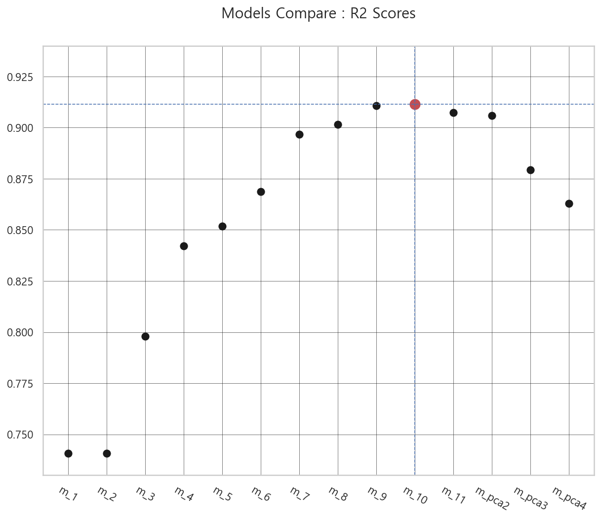
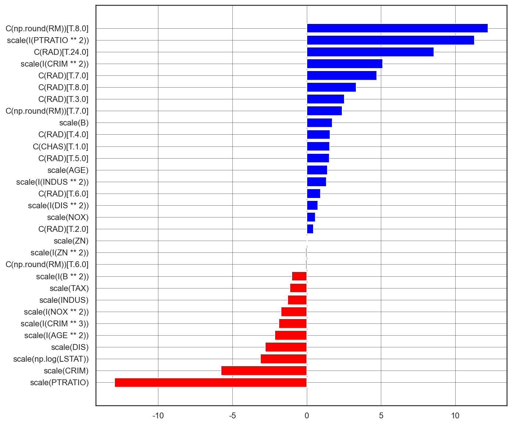
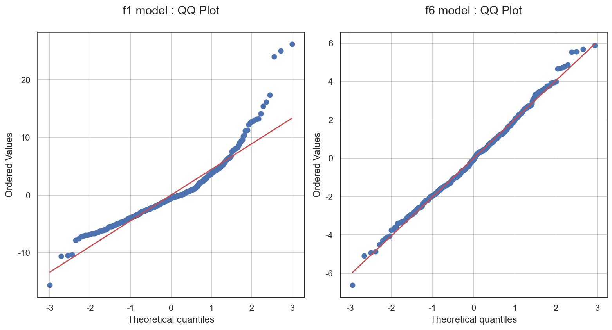

# 선형회귀 분석을 사용한 Boston Housing Data 집값 예측 프로젝트

 

## <레포지토리 구성>
- `프로젝트 파일` 
    - 01_linear_regression_analysis_boston_housing.md
- `프로젝트에서 사용한 함수 정리 파일`
    - 02_used_functions.py
- `이미지 파일 디렉토리`
    - images

## 1. 분석 개요

### 1-1. 분석 목적
- 집값 요인에 대한 가설과 회귀분석을 통해서 얻은 지식의 차이를 비교한다.
- 회귀 모델을 사용하여 데이터로부터 예측값을 측정한다.
- 선형회귀 분석 방법을 사용하여 회귀 모델의 성능을 개선하기 위한 모델링을 적용한다.

### 1-2. 분석 대상
- scikit-learn의 datasets 패키지의 boston 데이터를 사용한다.
    - UCI의 Boston Housing Data에 기초한다.
    
### 1-3. 분석 방법
- stats-models의 OLS 회귀분석 패지키를 사용한다.
    - 확률론적 선형회귀 모델을 기반으로 회귀분석 이론을 구현할 수 있는 다양한 서브 패키지, 클래스, 매서드를 사용할 수 있는 장점이 있다.
    - 데이터의 독립변수별로 여러 수학연산과 비선형 변형을 쉽게 적용할 수 있는 from_formula 매서드를 모델에 직접 적용할 수 있는 장점이 있다.
    - 선형회귀 분석 결과와 모델을 검증할 수 있는 여러가지 측정값을 쉽게 사용할 수 있는 장점이 있다.
    
### 1-4. 프로젝트 순서
1) 가설 수립
    - 보스턴 지역의 주거 환경에 관한 배경지식
    - 분석 목적에 부합하는 가설 설정
2) 데이터 EDA
    - 데이터 탐색
    - 데이터 전처리
    - 독립변수 분석 및 변형
3) 모델링
    - formula 설정 및 적용
    - OLS model 생성, 모수추정
    - 총 14개의 모델 생성 : m_1, m_2, m_3, m_4, m_5, m_6, m_7, m_8, m_9, m_10, m_11, m_pca30, m_pca25, m_pca20
4) 모델 검증
    - OLS 레포트의 성능지표 분석
    - 교차 검증
    - 잔차의 정규성 검정
    - QQ플롯
    - VIF score, Correlation, ANOVA score
5) 모델 수정
    - 데이터 전처리
    - 독립변수의 비선형 변형
    - 수정 사항을 반영하여 재 모델링 3), 4) 진행
6) 분석결과
    - 모델별 성능 지표 및 통계값 비교
    - 모델별 잔차의 정규성 분석 비교
    - 예측 가중치 비교
7) 프로젝트 결과 1
    - 모델의 성능 비교 : 데이터 프레임과 산점도
    - 최초 모델과 최종 모델의 잔차-종속변수 분포 비교
    - 최초 모델과 최종 모델의 예측 가중치 비교
    - 최종 모델의 부분회귀 플롯으로 예측 가중치의 상관관계 분석
    - 최초 모델과 최종 모델의 잔차의 정규성 검정 : QQ플롯
    - 최초 모델과 최종 모델의 예측가격-실제가격 분포 비교    
8) 프로젝트 결과 2 : 분석 목적에 대한 결론
9) 프로젝트 결과 3 : 프로젝트를 마치며

## 2. 프로젝트 요약

### 2-1. Boston Housing Data 분석 과정

### 2-2. (프로젝트 결과 1-2) 모델의 성능 비교 : r2 산점도
- 산점도의 기울기가 급격하게 증가하는 m_2와 m_3 구간은 변수의 중요도가 낮고 상관관계가 높은 독립변수 LSTAT와 DIS를 비선형 변형한 지점이다. 또한 두 독립변수는 종속변수와의 비선형 관계가 상대적으로 더 뚜렷하다. 두 독립변수를 비선형 변형함으로써 잔차의 분산(RSS)이 크게 줄어들어 성능(r2) 또한 크게 개선 된 것으로 보인다.
- 또한 기울기가 크게 변하는 m_3와 m_4, m_6과 m_7 구간은 각각 아웃라이어를 제거한 지점에 해당한다.
- 성능이 가장 높은 m_10은 3차 아웃라이어 제거와 모든 독립변수의 비선형 변형이 적용된 모델이다.
    - 성능이 비슷한 m_9과 m_10의 차이는 독립변수 LSTAT의 비선형 변형의 차이이다. m_9는 2차형 변형을 적용하였고, m_10은 로그 변형을 적용하였다.
- m_11 변수선택법을 사용하여 독립변수 ZN과 AGE를 제거한 모델이고, m_pca1, m_pca_2, m_pca3은 PCA를 사용하여 데이터의 차원축소를 한 모델이다. 과최적화가 발생하지 않아 데이터의 크기가 줄면서 성능이 줄어든다. 반면 PCA 모델에서 F-검정값이 낮아지면서 데이터의 적합도는 오히려 개선되는 현상을 보인다.

  

### 2-3. (프로젝트 결과 1-4-3) 최종 모델의 예측 가중치 막대 그래프
- 양의 계수 : RM(8,7), PTRATIO(2차), RAD(24,7,8,3,4,5,6,2), CRIM(2차), B, CHAS(1), AGE, INDUS(2차), DIS(2차), NOX
- 음의 계수 : ZN(1,2차), RM(6), B(2차), TAX, INDUS(1차), NOX(2차), CRIM(3차,1차), AGE(2차), DIS, LSTAT(로그), CRIM(1차), PTRATIO
- 같은 독립변수라도 비선형 변형에 따라서 음, 양의 계수값으로 구분 될 수 있다.
- ZN은 최초모델과 최종모델에서 계수의 부호가 양에서 음으로 바뀌었다.
- RM은 클래스 6이 양에서 음의 계수로 바뀌었다.
- NOX는 기본형이 음에서 양의 계수로 바뀌었다.
- PTRATIO, CRIM, INDUS, NOX, AGE, DIS는 비선형 변형 변수들이 각각 음과 양의 계수값으로 나타난다. 특히 PTRATIO 변수는 음과 양의 계수값이 매우 크다.
    

  

    
### 2-4. (프로젝트 결과 1-6) 최초 모델과 최종 모델의 잔차의 정규성 검정 : QQ플롯 비교
- **m_6이 m_1보다 잔차의 분포가 정규분포에 더 가까우므로 모델의 적합도가 더 높다고 볼 수 있다.**
- m_1은 2차형 곡선 처럼 휘어져 있고 중심분포에서 떨어진 데이터들의 거리가 멀다.
- m_6의 분포는 직선에 가깝고 중심분포에서 떨어진 데이터들의 거리가 가깝다.    

  

### 2-5. (프로젝트 결과 2) 가설 2 "집값을 증가, 감소 시키는 가장 큰 요인 3가지"의 검증 
- 집값을 증가시키는 요인
    - 가설 : 1위 RM, 2위 CHAS, 3위 ZN
    - 분석 : 1위 RAD, 2위 RM, 3위 B
- 집값을 감소시키는 요인
    - 가설 : 1위 AGE, 2위 INDUS, 3위 CRIM
    - 분석 : 1위 LSTAT, 2위 DIS, 3위 PTRATIO

### 2-6. (프로젝트 결과 3) 프로젝트를 마치며

- **선형회귀 분석은 데이터사이언스의 다양한 분야(회귀, 분류, 딥러닝, 최적화 등)의 이론적 토대를 제공한다.** 복잡한 데이터를 선형대수와 확률론의 이론을 사용하여 매우 효율적이고 간단하게 분석 할 수 있으며, 예측(회귀, 분류)이라는 행위를 가능하게 하기 때문이다.
- 이러한 점에서 Boston Housing Data 선형회귀 분석을 한 이유는 그동안 공부했던 선형대수와 확률론 등의 분석이론들을 모델링 과정에서 발생하는 여러 현상들과 대조하여 확인해보고, 어떻게 문제를 해결할 수 있을지 최대한 과학적이고 정합적으로 접근해보기 위해서 였다. **즉 성능이 높은 회귀모델을 찾는 것에 목적을 두기보다, 어떻게 하면 현재 발생한 문제를 과학적으로 해결할 수 있을지에 목적을 두었다.**
- 또한 분석 과정에서 선형회귀 이론의 부족한 부분이나 직접 작성한 코드의 문제점들이 발생한 경우 **인터넷 검색을 활용하여 관련 자료들을 찾고, 재적용 해봄으로써 문제점을 개선하였다.**
- 데이터 자체에 대한 의미를 이해하기 위해 보스턴 도시의 역사적, 환경적 배경을 함께 조사하였고 이 과정에서 Boston Housing Data에 몰입할 수 있었다. 이러한 몰입은 내가 이 Boston Housing Data를 핸들링하며 중요한 인사이트를 발견해내야만하는 데이터 사이언티스트라고 가정하는데 도움이 되었고 **간단한 분석행위에 대해서도 합당한 이유를 찾기위해 고민할 수 있었다.**
- 나아가 실무에서 활용할 데이터 사이언스의 궁극적인 목적은 사업성을 가진 인사이트를 도출하는 것이며 **이 인사이트의 근거를 해석하는 과정에서 회사의 사업행위 자체가 개선된다고 생각하게 되었다.** 예를들어 부동산의 가치를 예측하는 서비스를 제공하는 회사에서 모델링을 통하여 집값을 증가시키는 요인으로 A를 찾았다면 우연히 어떤 코드를 적용해서 나온 것이 아니라, 선형회귀분석이라는 과학적 정합성속에서 신뢰할 수 있을 만한 수준의 결과라는 것을 제안할 수 있어야 하는 것이다. 이 제안이 옳았다면, 회사의 각 조직은 A 요인을 실제로 관리하거나 개선시키는 다양한 노력을 하게 될 것이고 이를 계기로 사업이 한단계 성장할 것이다.
- **또한 어떤 현상에 대하여 경험적 지식과 현상을 수치화한 데이터의 분석결과가 일치하지 않을 수 있지만 두 지식을 적절하게 결합하면 사업분야에서 의미있는 성과를 도출할 수 있을 것이라는 생각을 할 수 있었다.** 일반적으로 과학적 분석의 결과를 좀 더 신뢰하고 경험적 지식을 배제하게 되지만 불일치와 관련한 다른 요소의 관점에서 본다면 두 지식 모두 유의미할 수 있기 때문이다. 예를들면 위의 가설 검증 중에서 집값을 감소시키는 요인으로 경험적 지식에 의해 INDUS(산업부지의 비율)를 선택했지만 데이터 분석결과는 INDUS가 집값을 증가시키는 요인으로 나온 경우를 들 수 있다. 경험적 지식으로는 집 주변에 산업부지의 비율이 높다면 산업시설이 늘어날 수 있으므로 집값이 떨어질 것으로 생각했지만, 데이터의 시점에서 도시의 산업이 발달하면서 노동자가 많이 유입되는 상황이라면 산업시설 근처에 위치한 집일 수록 집값은 높아질 수 있고 두 지식이 일치하지 않게 된다. **이러한 경우 두 지식의 불일치와 관련된 "직업별 인구수"라는 관점에서 본다면 INDUS로 집값이 감소하는 지역과 INDUS로 집값이 증가하는 지역을 구분하고 사업의 서비스 역량을 차별화하거나 한 곳에 집중시킴으로써 서비스 효과를 극대화 시킬 수 있을 것이다.**

### 더 자세한 내용은 프로젝트 파일을 참고 해주시기 바랍니다.
