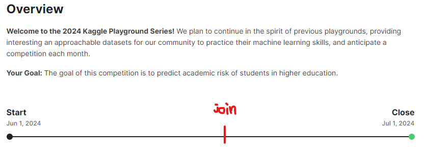
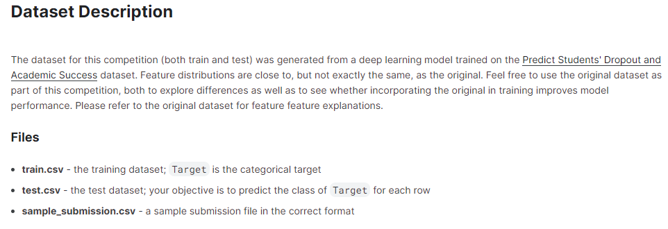
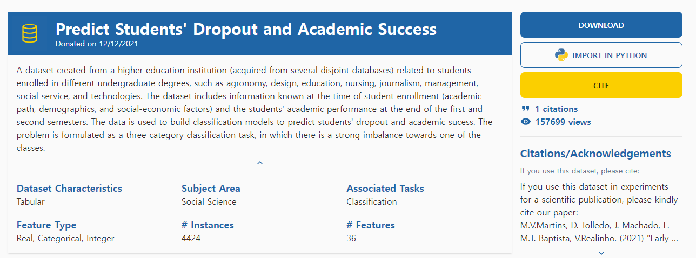
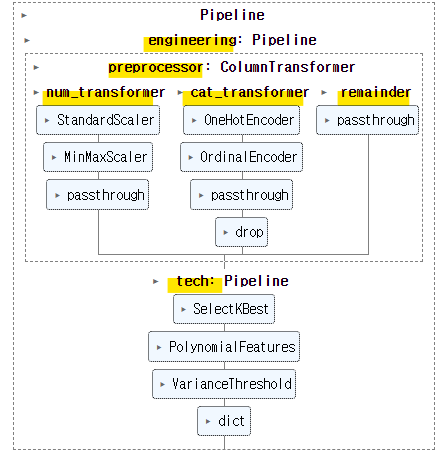
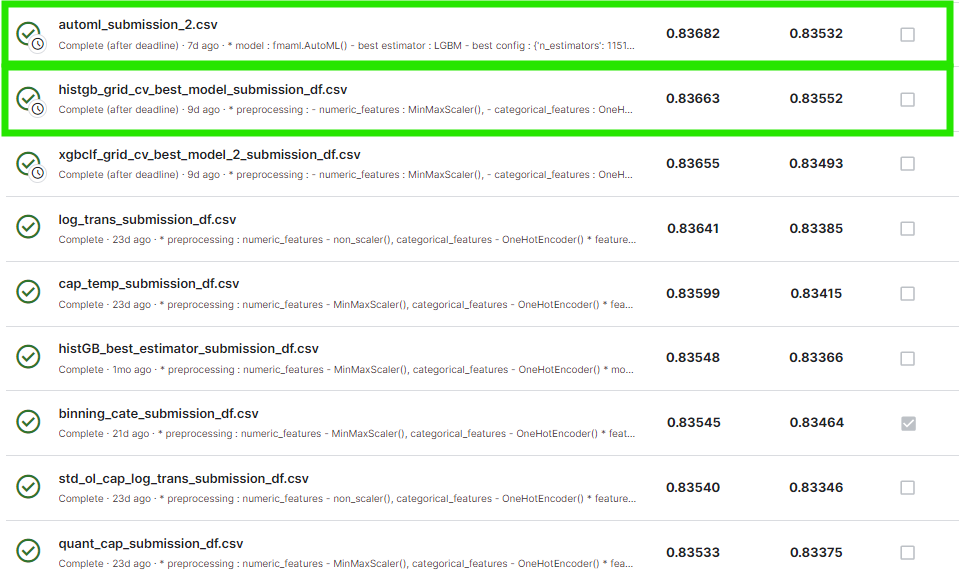
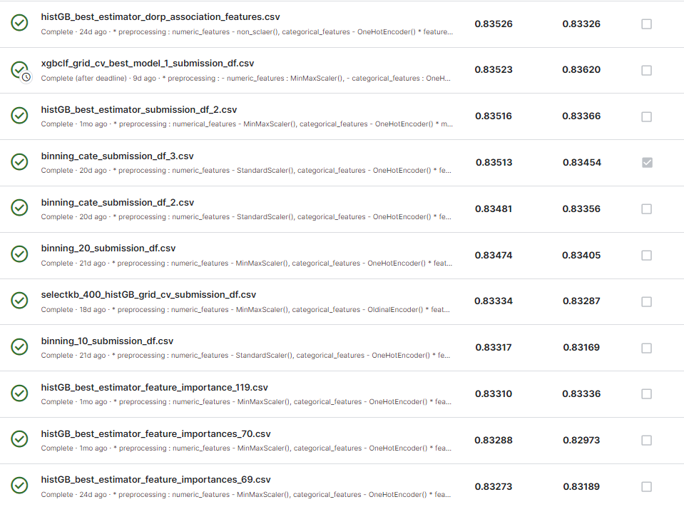
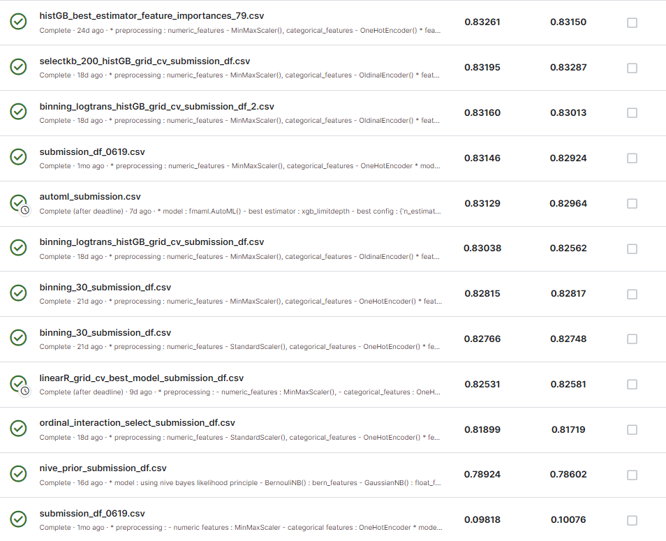
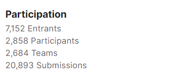
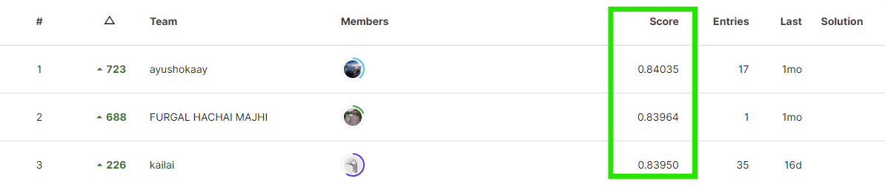
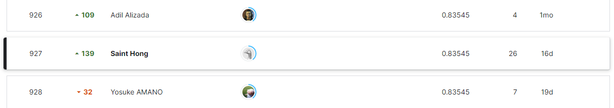

# Kaggle Compettion Student Classification
- 케글 컴피티션 중 하나로 학생의 생활기록부 데이터를 사용하여 졸업여부에 대한 예측 모델의 성능을 테스트 한다. 학습 데이터는 포르투갈 기반의 연구소에서 제작 된 고등학생들의 생활기록부와 같은 데이터로 UCI Machine Learning Repository 가 원본 데이터이다. 다양한 학부 학위에 등록한 학생들의 고등 교육 기관에서 생선 된 여러 데이터 세트를 취합하여 만들어 졌다.   
- 이번 케글 컴피티션에 참여하게 된 것은 학습 데이터가 기계적인 과정을 거쳐 만들어졌거나 자연적으로 발생한 것이 아닌 다양한 사람들이 각자의 선택에 따라서 내린 결정들의 결과물이라는 점이 흥미로웠기 떄문이다. 인간 행위의 산물을 데이터화하고 이러한 데이터를 학습 데이터로 사용하여 머신러닝 모델로부터 미래의 어떠한 결론을 예측해보고 싶었다.
- 지금까지 예측 성능을 높이기 위한 모델링 과정에서 어떠한 경우 학습 데이터에 대한 의외로 아주 간단한 전처리나 feature engineering 만으로도 성능이 개선될 수 있다는 것을 알 수 있었다. 복잡한 하이퍼 파라미터 튜닝을 오랜시간 지속해서 얻은 모델이라고 해도 성능이 월등히 높아지지 않는 이유이기도 하다. 따라서 이번 케글 컴피티션에서는 모델링 자체에 많은 시간을 할애하기 보다 기본 모델을 하나 선택해 놓고, 다양한 전처리, 다양한 engineering을 우선 시도하여 모델 성능에 변화를 주는 어떤 데이터 상태를 찾아보고자 했다.

## Compettion Info

### 컴피티션 일정
- 6/1 부터 7/1 까지 하루에 다섯번 결과물을 제출할 수 있다. 6/16일께 참여하였다.

### 데이터 정보
- 컴피티션에서 제공하는 데이터는 train, test, sample_submission 3가지이다. 
- train 데이터는 76518개의 표본과 36개의 독립변수(id, target 제외)로 이루어져 있고, test 데이터는 51012개의 표본과 36개의  독립변수(feature)로 이루어져 있다. 또한 종속변수 Target은 "Graduate", "Dropout", "Enrolled" 3가지의 멀티 클래스로 이루어져 있다.
- sample_submission 파일은 test 데이터에 대한 예측값을 저장하여 제출할 때 사용하는 양식이다.

### 원본 데이터
- 이 데이터는 UCI의 Machine Learning Repository의 원본 데이터를 사용했다. 또한 원본 데이터와 다르게 범주형 독립변수의 데이터가 모두 정수값으로 변환되어 있다.
- UCI의 페이지에서 각 feature에 대한 설명을 확인 할 수있다. 
   - https://archive.ics.uci.edu/dataset/697/predict+students+dropout+and+academic+success

## 개요

### file 1 : EDA, Preprocessor, Feature engineering, Modeling test
- **1. Setting**
   - 데이터 분석 및 분류문제 예측을 위한 기본적인 패키지 임포트
   - 시각화를 위한 seaborn의 환경 셋팅
- **2. EDA**
   - Data info : 훈련, 검증 데이터의 길이, feature의 종류, dtype 등 기본적인 정보 확인 : 36개의 숫자형, 범주형 변수와 76518개의 표본으로 이루어진 훈련 데이터, 51012개로 이루어진 검증 데이터
   - Null Data : null 데이터 없음
   - Unique Values : feature 별 유니크 값의 갯수를 파악하여 feature의 특징 파악 및 Target feature는 클래스 갯수가 3개인 멀티 클래스인 것을 확인
   - Distribution of Features : 모델링 과정에서 중요한 feature의 타입을 설정하기 위해 각 분포를 시각화하여 확인, UCI 원본 데이터의 feature 별 설명 정보를 임포트하여 데이터가 의미하는 것을 확인
   - numeric, categorical feature : 앞의 EDA를 통하여 feature별 numeric 또는 categorical type을 설정하고 구분
   - Association : Target feature와 개별 feature 간의 연관성을 확인하기 위하여, 피어슨 계수 외에 dtype 별 point biserial correlation, chi2 test, phi coeff, cramers V coeff 등의 방법을 사용
   - Analysis : numeric, categorical feature 중 Target과 연관성이 높은 것 5개의 Target 과의 분포 확인
- **3. Modelling**
   - 시간이 오래 걸리는 Hyper parameter tunning 전에 우선 학습 데이터의 다양한 전처리 및 feature engineering을 통해 기본 모델인 HistGradientBoosting로 모델 성능을 지속적으로 테스트하였다. 이로부터 어떤 상태의 학습 데이터가 모델 성능에 더 좋은지 확인하였다.
   - numeric, categorical features split
   - Data Transform
   - feature_preprocessor pipeline 생성
   - feature별 전처리 방법을 달리하하여 모델 성능 실험
   - Feature Engineering과 Submission
   - feature engineering 시도
      - feature importance로 feature 선택
      - association features
      - outlier cap 적용
      - log transform
      - log transform + outlier cap
      - numeric feature binning
      - categorical feature binning
      - feature interaction, select 추가
      - SelectKBest() 설정
      - numeric, categorical features binning + log transform
      - 나이브 베이즈 결합 모형

### file 2 : Hyper parameter tunning test
- **1. Data Setting**
- **2. numeric, categorical features setting**
- **3. feature engineering setting**
- **4. Modeling**
   - 전체 모델을 기본 설정한 후 전처리, feature engineering을 변경하여 모델 성능 테스트, test 1 ~ test 10
   - 전처리와 feature entineering 중 어떤 조합이 좀더 성능이 나은지 테스트
- **5. Hyper parameter Tunning**
   - 훈련 데이터의 전처리 mms, onehot 방법을 기본으로하여 각 개별 모델별 hyper paramter tunning
- **6. Best estimator Submission**
   - hyper parameter tunning의 best estimator 중 상위 3개 모델을 사용하여 GridCV로 재 fitting 후 test data의 예측값 추정 및 submission

### file 3 : AutoML test
- **1. Setting**
- **2. Data Search**
- **3. Feature dtype 재조정**
   - numeric, categorical feature를 재조정하여 모델의 성능 테스트
- **4. Feature의 이름에서 공백 제거**
- **5. DataFrame memory 최적화**
- **6. AutoML Modeling (1)**
   - AutoML 기본 설정으로 성능 테스트
- **7. AutoML Modeling (2)**
   - 학습 데이터의 모든 데이터를 원본 데이터의 범주형 값으로 변경한 후 성능 테스트

## Review

### 컴피티션 참여 후기
- 이전 컴피티션에서 모델의 성능이 하이퍼 파라미터 튜닝에 많은 시간을 들여도 높아지지 않는 다는 것을 알 수 있었다. 특히 학습 데이터의 가장 기본 형태에서 간단한 전처리나 feature engineering으로 처리만 한 경우에 오히려 성능이 쉽게 높아질 수 있었다. 이러한 현상은 모델의 성능은 우선적으로 질 좋은 학습 데이터의 영향을 받기 때문인 것으로 생각해 볼 수 있었다. 
- 따라서 이번 컴피티션에서는 featuer engineering의 다양한 방법을 조사하고,학습 데이터에 직접 적용하여 모델의 성능을 테스트 하는데 더 많은 시간을 들였다. feature engineering 방법으로는 잘 알려진 null 값 채우기, outlier 처리, log 변환, binning, groupping, feature interaction, feature select를 사용하였고, 각 방법을 시도할 때마다 모델의 성능을 측정하였다.
- 컴피티션 성능 랭킹에서도 볼 수 있듯이 이 데이터의 예측 성능은 0.83~0.84 범위로 제한적인 것으로 보였고, boosting 계열의 크기가 큰 데이터에서 성능이 잘 발휘되는 HistGradientBoostingClassifier 모델을 기본 모델로 선택하여 다양한 전처리와 featuer engineering 방법들을 적용하여 성능의 변화를 우선 테스트 하였다.
- 이렇게 전처리와 feature enginnering 방법들 중 성능이 높은 편에 속하는 방법을 정하고, HistGB 모델 외에도 같은 계열의 RandomForestClassifer, XGBClassifier와 확률적 판별모형의 하나인 LinearDiscriminantAnalysis와 LogisticRegression 모델을 추가하여 다양한 하이퍼 파라미터 튜닝을 시도하였다.
- 또한 나이브 베이즈 모델의 모수 추정(fitting) 원리인 나이브 가정을 적용하여, 예측값을 추정하기 위한 베이즈 정리의 값을 구해 보기도 하였다. 이를 위하여 numeric, binary, categorical feature 별로 다른 나이브 모델을 사용한 후 가능도(likelihood)를 곱하여 측정하였고, 하나의 나이브 베이즈 모델을 사용하여 예측 성능을 측정했을 때보다 조금 더 나은 성능을 측정할 수 있었다.
- 컴피티션 막바지 기간 즈음에 Discussion 페이지에서 참가자들의 여러가지 논쟁거리 중 AutoML을 사용한 방법에 대한 글을 참조할 수 있었고, 마이크로 소프트의 AutoML 모델을 처음 사용해 볼 수 있었다. 여러가지 머신러닝 모델의 하이퍼 파라미터 튜닝을 한 번의 명령어로 간편하게 진행할 수 있었다. 그러나 AutoML 모델도 이 자체의 다양한 parameter들을 설정하여야 높은 성능의 모델을 만들 수 있었다.
- 컴피티션 과정에서 32번의 submission 파일을 제출하였고 가장 높은 score는 0.83682로 Automl의 LGBM 모델이었다. 두 번째로 높은 score는 0.83663으로 MinMaxScaler와 OneHotEncoder를 사용하고 feature interacition 이나 feature select 방법을 사용하지 않은 HistGB 모델이었다.

### 컴피티션 결과
- 전체 참가자는 7,152명이고 이중 실제 참여자는 2,858명이다. 이 중에서 팀 참가자는 2,684명이었다.
- 특히 test 데이터에 대한 예측값을 제출수한 횟수는 20,893 건이다.

### 전체 모델 성능 랭킹
- private rank : test 데이터의 80%를 사용하여 계산 된 랭킹
- 가장 예측 성능이 높은 경우는 0.84035 이다. 대체로 성능이 월등히 높은 컴피티션이 아니었다는 것을 알 수 있었다.

- 나의 모델링 예측 성능은 0.83545로, 전체 2만건 중 927위를 기록했다. 컴피티션이 끝난 후 추가로 테스트한 모델의 성능 중 가장 높았던 score 0.83682가 반영 되었다면 468위에 기록할 수 있었을 것이다.

### 보완 해야할 점
- 여러가지 AutoML 모델의 사용법을 익힌 후 모델링에 적용해 본다.
- Discussion 페이지를 적극적으로 활용하여 컴피디션에 대한 정보 뿐만 아니라 그 외 유용한 정보들을 취합하여 사용한다.
- 크기가 큰 데이터의 경우 모델의 학습 과정에서 메모리 문제로 에러가 나는 경우가 있었다. 이러한 것을 해결하기 위하여 데이터를 조각을 나누어 모델을 점진적으로 학습시키는 방법을 적용해 보면 좋을 것 같다. 
- 앙상블 사용시 개별 모델을 어떤 조합으로 사용하면 좋을지에 대한 통계적 분석 방법이 있는지 확인 해 보면 좋을 것 같다.
- 학습 데이터 세트에서 categorical feature를 어떤것으로 선택하는지가 하나의 변수가 될 수 있다는 것을 알게 되었다.범주형 변수를 정의하기 위해 단순히 크기를 비교할 수 없는 데이터라는 정의에서 나아가 좀 더 구체적이고 명확한 방법이 있는지 확인 해 볼 것이다.

