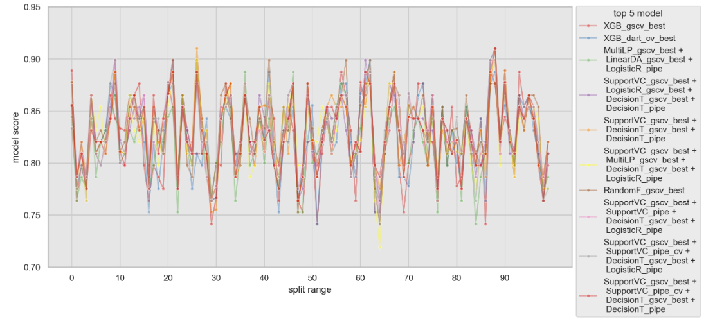

# Kaggle Compettion Titanic Classification
케글의 모델 성능 대회에 처음 참여하여 "타이타닉" 데이터를 사용한 분류문제를 예측해 보았다. 타이타닉 승객 데이터는 데이터 분석 및 머신러닝 모델링을 위해 자주 사용하는 기본적인 데이터이지만 이번에 케글 경쟁의 첫 참여를 통해서 다양한 분석 방법, 모델링 방법 등을 적용하며 더 나은 예측 모형을 만들기 위해 노력해 볼 수 있었던 재미있었던 시간이었다. 이외에도 케글 compettion의 규칙, 각종 메뉴들을 이용하는 방법 등을 함께 숙지할 수 있었다.

## Titanic Compettion info 1
- 데이터 셋에서 승객의 생존여부를 예측하는 것이 목표이다.
- 검증 데이터 셋의 예측값을 평가하는 기준은 정확도(accuracy)이다.
- submission file은 양식을 맞추어 csv 파일로 제출해야한다.

## Titanic Compettion info 2
- 훈련 데이터(train data) 셋과 검증 데이터(test data) 셋 그리고 제출용 데이터는 각각 따로 csv 파일로 다운로드 받을 수 있다.
- 훈련 데이터 셋으로 모델을 학습시키고 검증 데이터를 통해 생존 여부를 예측한다.
- 예측값을 submission 파일 형태로 제출한다. 

## 개요
- 1. **Feature Engineering**
    - null search : 데이터에 null 값이 있는지 확인 한다. null 값의 비율, missingno 패키지를 사용하여 null 값을 시각화하고 null 값이 있는 경우 다른 값으로 대체하기 위한 방법을 모색했다.
    - Name feature에서 호칭 찾기 : Feature Engineering의 대표적인 방법 중 하나로 feature를 split 한다. 타이타닉 데이터에는 승객들의 이름 정보가 담긴 feature가 있는데 여기에서 승객을 구분할 수 있는 특징적인 text 데이터를 추출하는 방식이다. 추가로 각 호칭별 빈도수를 조사하여 빈도수가 작은 경우 다른 호칭과 grouping을 하였다.
    - Age Groupping : 타이타닉 데이터의 Age feature는 승객의 나이 데이터로 이루어져 있다. 이로부터 특정 연령대별로 groupping을 적용하였다.
    - Ticket feature에서 description 추출한 후 그룹핑 : 승객의 ticket 데이터에는 반복적으로 확인되는 ticket  정보가 있는데 이것을 추출하여 그룹핑 하였다.
- 2. **Data EDA**
   - 예측의 목적인 Target = 생존여부 feature를 기준으로 Age, Sex, Pclass 등 각 feature 별 분포를 시각화하고, 모델에 도움이 될 수 있는 데이터 자체의 인사이트를 찾아 보았다.
- 3. **Modeling**
    - 전체 개별 모델의 pipe line을 만들고 cross validate(n_splits=5) 성능 측정
       - 확률적 생성 모형(probabilistic genesis model) : LDA/QDA, Naive Bayes(GaussianNB, BernoulliNB, MultinomialNB)
       - 확률적 판별 모형probabilistic discriminant model) : LogisticRegression, DecisionTree
       - 판별 모형(discriminant mode)l : Multi Layler Perceptrone(MLP), Support Vector Machine(SVC)
       - 모형 결합(Ensemble) : RandomForest, ExtraTrees
    - 하이퍼 파라미터 튜닝(hyper parameter tunning)
       - 개별 모델 pipe line을 각 모형의 하이퍼 파라미터를 바꿔가며 모형 최적화 3회 실험 후 best 모델 선택하여 cross validata 성능 측정
       - Naive Bayes 모델의 경우 가능도(likelihood) 결합 방식 추가 테스트 : 학습 데이터의 dtype 별 각기 다른 NB 모델을 사용하여 likelihood 계산 후 결합하여 최종 predict를 예측하는 방식
    - 모형 결합 방법(Ensemble)
       - 개별 모델과 hyperparameter tunning best 모델을 조합하여 VotingC, BaggingC, AdaBoost로 성능 측정
       - XGBoost 모델의 hyperparmeter tunning 성능 측정
    - 성능 베스트 top 모델 5개에 대한 추가 실험
       - feature select 방법을 기존 VarianceThreshold에서 SelectKBest, SelectFromModel 기술을 추가 적용하여 성능의 변화 측정
    - 통계적 방법을 사용한 모델 성능 비교
       - Repeated cross validate를 사용하여 10X10 회 교차검증 한 성능 데이터를 기반으로 빈도주의적 방법과 베이지안 모델 검증
       - 통계적 모델 비교를 위하여 "Neauda and Bengio"의 실험 논문에서 인용한 수정표준편차, "Benavoli"의 분류모델의 성능 측정 논문에서 베이즈 분석의 정확성을 인용하여 모델 성능을 비교하였다.
    - 모형 성능 향상을 위해 기존과 다른 방법을 추가 적용
       - feature engineering step 제외 : pipeline의 step인 feature inter action과 feature select 과정에서 Target 예측에 영향을 미치는 중요한 feature가 제거될 수도 있으므로 이것을 제외하고 모형 실험
    - 최종 모델 선택
       - **통계적 모델 비교에서 가장 높은 성능이라고 파악 된 RandomF_grid_cv 모델과, feature engineering step을 제외한 실험에서 가장 성능이 높게 나온 xgb_dart_cv_best 모델 선택**

## 요약

### 모델링 성능 결과표
- 개별 모델, pipeline 모델, 앙상블, 하이퍼파라미터 튜닝 등의 다양한 실험을 거쳐서 총 24개의 모델을 선별하였고 test score는 다음과 같다.

- 모델링에 사용한 Pipeline의 feature engineering 과정에서 Target에 중요한 영향을 미치는 feature가 제거 되었을 수 있으므로, 모델링 마지막 단계에서 feature engineering을 사용하지 않은 pipeline으로 모델링을 다시 하여 비교하였다. 

### 통계적 방법을 사용한 모델 평가
- 모델의 비교를 위하여 100번의 교차검증을 시도한 후 각각 100개의 성능 데이터를 산출하였고, 이를 통하여 통계적 모델 평가 방법으로 빈도주의적 평가와 베이즈 검증 평가를 사용하였다. 

- 빈도주의적 모델 평가 과정에서 Neauda and Bengio의 논문에서 소개된 수정된 표준편차를 사용하여 p-value를 계산하여 귀무가설에 대한 검정을 시도하였다.

- 베이즈 추정법에 의한 모델 평가에서는 Benavoli의 논문에서 소개 된 분류 모델의 비교에서 베이즈 분석이 더 효과적이라는 관점을 사용하였다. A, B 모델의 성능 데이터를 스튜던트 t 분포를 통해 추정하여 어떤 모델이 더 성능이 높은지에대한 가설 검증을 시도하였다. 

- t_test, p_value, worst_prob(A모델이 낮을 확률), better_prob(A모델이 높을 확률), prac_prob(두 모델 성능의 차이가 1%이내일 확률) 값을 계산하여 모델을 비교하였다.

## Review
- 케글의 compettion의 기능과 룰을 이해할 수 있었다.
- feature engineering과 hyper parmeter tunning에 많은 시간을 할애 했으나 좋은 score를 얻지는 못했다. 이 과정에서 모형의 성능 향상을 위해 너무 복잡한 feature engineering과 hyper parameter tunning에 의존하면 안된다는 것을 알 수 있었다.
- hyper parameter tunning의 수 많은 조합을 모두 테스트하기에는 현실적 제약이 있으므로 이것을 단축하기 위해서 모수추정(fitting) 방법이 유사한 모델들 중 대표적인 모델을 우선 선택하여 성능을 측정해가면서 다른 모델들로 확장하여 사용하는 것이 효과적인 방법이 될 수 있을 것 같다.  
- 또한 훈련 데이터의 가장 기본 형태를 우선적으로 모델링 실험하여 성능이 어느정도 인지 비교해가면서 feature engineering 작업에 더 많은 시간을 할애하는 것이 좋은 것 같다.
- Discussion 메뉴를 적극적으로 사용하여 모델의 성능 향상에 관한 다른 참가자들의 경험, 의견, 부분적 풀이 방법들을 참고하고 함께 논의하는 과정도 필요하다는 것을 알 수 있었다.

