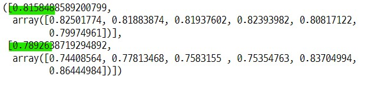
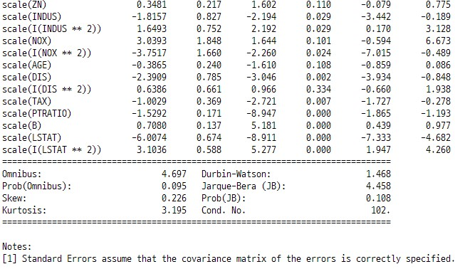

# 프로젝트 : 선형회귀 분석을 사용한 Boston Housing Data 집값 예측

<p align=center>  </p>

## 1. 분석 개요

### 1-1. 분석 목적
1) 집값 요인에 대한 경험적 지식과 회귀 분석을 통해서 얻은 지식의 차이를 비교한다.
2) 회귀 모델을 사용하여 데이터로부터 예측값을 측정한다.
3) 선형회귀 분석 방법을 사용하여 회귀 모델의 성능을 개선하기 위한 모델링을 적용한다.

### 1-2. 분석 대상
- scikit-learn의 datasets 패키지의 boston 데이터를 사용한다.
    - UCI의 Boston Housing Data에 기초한다.

### 1-3. 분석 방법
- stats-models의 OLS 회귀분석 패지키를 사용한다.
    - 확률론적 선형회귀 모델을 기반으로 회귀분석 이론을 구현할 수 있는 다양한 서브 패키지, 클래스, 매서드를 사용할 수 있는 장점이 있다.
    - 데이터의 독립변수별로 여러 수학연산과 비선형 변형을 쉽게 적용할 수 있는 from_formula 매서드를 모델에 직접 적용할 수 있는 장점이 있다.
    - 선형회귀 분석 결과와 모델을 검증할 수 있는 여러가지 측정값을 쉽게 사용할 수 있는 장점이 있다.

### 1-4. 프로젝트 순서
1) 가설 수립
    - 보스턴 지역의 주거 환경에 관한 배경지식
    - 분석 목적에 부합하는 가설 설정
2) 데이터 EDA
    - 데이터 탐색
    - 데이터 전처리
    - 독립변수 분석
3) 모델링
    - formula 설정
    - OLS model 생성, 모수추정
4) 모델 검증
    - OLS 레포트의 통계값 분석
    - 교차 검증
    - 잔차의 정규성 검정
    - VIF score, Correlation, ANOVA score
5) 모델 수정
    - 데이터 전처리
    - 독립변수의 비선형 변형
    - 수정 사항을 반영하여 다시 3), 4) 진행
6) 분석결과
    - 모델별 성능 및 통계값 비교
    - 잔차의 정규성 검정값 비교

## 2. Boston Housing Data의 배경
<figure>
	<p align=center>  <p>
	<figcaption align=center>
		<em> 선거구별로 나누어진 보스턴 도시의 지도 </em>
	</figcaption>
</figure>	
	
> **보스턴은** 미국 메사추세츠 주의 주 도시로 교육, 의료, 경제, 항만, 문화 산업이 발달한 미국의 대표적인 도시중 하나이다. 특히 "미국의 아테네"라는 수식어에 걸맞게 아름다운 보스턴 항만과 찰스강을 따라서 세계적인 수준의 대학교와 교육기관들이 자리잡고 있으며, 이들 대학교에서 운영하는 의료시설들과 보스턴 정부의 다채로운 문화산업 시설들이 있어 높은 수준의 인프라 환경을 자랑하는 세계적인 도시로 알려져 있다. 

<p align=center>  </p>

> **이러한 배경에는** 19세기 후반부터 발달한 항만 산업을 토대로 경제가 규모가 커지면서 많은 사람들이 보스턴으로 모여들면서 발생한 도시문제와 이를 해결하려는 보스턴 정부의 오랜 도시 재생 사업의 노력이 있어던 것으로 보인다. 20세기 중반을 전후로 도시의 특정 지역에 높아지는 인구밀도와 반대로 다른 지역에서 발생하는 인구감소 문제 등이 발생하면서 여러 도시 재생사업이 대규모로 진행되었고, 보스턴의 도시재생 사업은 낙후된 도시를 새롭게 재생시키고자하는 세계적인 모범 사례로 손 꼽히기도 한다.

<p align=center>  </p>

> **보스턴 정부는** 1950년대를 전후로 대대적인 도시재생 사업을 진행하였는데 이 과정에서 도시의 환경에 관한 다양한 조사 연구가 진행 되었다. 인구밀도의 증가와 함께 도시 환경이 변화하면서 주거 문제 개선이 도시재생 사업의 주요한 해결과제가 되었다. 보스턴 정부는 오랜시간 도시 재생 사업을 전개하면서 사람, 주거, 문화, 역사, 경제를 유기적으로 연결하기 위해 노력했다. 이러한 과정에서 모범적인 사례들뿐만 아니라 여러 실패의 사례들도 발생하였는데 이를 개선해나감으로써 오늘날의 보스턴이 만들어 질 수 있었다. **이 선형회귀 분석 프로젝트의 대상으로 삼은 Boston Housing Data는 보스턴의 이러한 분위기속에서 만들어진 데이터로 보스턴 지역 주거 환경의 13가지 요인 데이터와 집값 데이터를 포함하고 있다.**

## 3. 가설 수립
1) **경험적 지식 : 집값에 가장 큰 영향을 미치는 요인은 무엇일까? (데이터의 특징 중에서 선택)**
    - CRIM : 도시별 1인당 범죄율이 높을 수록 집값은 떨어질 것이다.
    - RM : 평균 방의 갯수가 높은 집일 수록 집값은 높아질 것이다.
    - AGE : 오래 된 집일 수록 집값은 떨어질 것이다.
    - LSTAT : 인구밀도가 낮을 수록 집값은 높아질 것이다.
    - CHAS : 찰스강 변에 위치한 집일 수록 집값은 높아질 것이다.
2) **분석적 지식 : 선형회귀 모델을 통한 회귀 분석의 결과는 경험적 지식과 어떻게 다를까?**
    - 모형의 성능이 높아지는 것과 집값 요인을 분석하는 것의 의미는 무엇인가?
3) **선형회귀 모델의 회귀분석 결과를 통해서 어떤 통찰을 얻을 수 있을까?**

## 4. 모델링 과정
1) **데이터 EDA**
    - 데이터 탐색
    - 데이터 전처리
    - 독립변수 분석 및 변형
2) **모델링**
    - formula 적용
    - OLS 모델 생성
    - OLS report 분석
3) **모델 검증**
    - 모델 성능 지표 분석
    - 교차 검증
    - 잔차의 정규성 검정
    - QQ플롯
    - ANOVA, Correlation, VIF, PCA 분석
4) **검증 결과를 토대로 데이터 EDA**
    - 데이터 전처리 : 아웃라이어 제거
    - 독립변수의 비선형 변형
5) **재 모델링**
    - formula 적용
    - OLS 모델 생성
    - OLS report 분석
6) **분석 결과**
    - 모델별 성능 지표 분석
    - 모델별 잔차의 정규성 분석
    - 예측 가중치 값 비교

### 4-1. 모델링에서 사용한 전제들
- **원본 데이터를 최대한 유지하는 방향으로 모델링을 시도한다.**
- **아웃라이어 측정 및 제거는 3번으로 제한한다.**
    - 모델이 완전하지 않으므로 모델링을 할 때마다 아웃라이어가 발생한다.
- **독립변수의 비선형 변형은 2차항까지만 진행한다.**
    - 다항회귀 모델의 차수가 늘어날 수록 모델의 성능은 증가하지만 다중공선성이 커져 모델의 적합성이 떨어진다.
    - 이러한 문제를 보완하기 위해 정규화(Rdige, Lasso, ElasticNet) 모델을 사용하여 최적화 할 수 있지만 이 과정은 선형회귀 분석이 아닌 히이퍼파라미터 튜닝이 중점이 아니게 된다.
    - 그러므로 독립변수의 비선형 변형 시 차수를 제한하고 최대한 선형회귀 분석의 방법들을 사용하여 모델링을 한다.

## 5. 데이터 EDA
1) 데이터 임포트
2) 데이터 프레임 변환
3) 데이터 크기 및 독립변수의 자료형 조회
4) 데이터 통계값 조회
5) 데이터 결측값 조회
6) 상관관계 조회 : heatmap()
7) 상관관계 조회 : pairplot()


### 5-1. 데이터 임포트
- scikit-learn의 datasets 패키지의 boston housing data 사용
- **독립변수와 종속변수의 의미**
    - CRIM    : 도시별 1인당 범죄율
    - ZN      : 25,000평방피트 이상의 부지에 대해 구획된 주거용 토지의 비율.
    - INDUS   : 도시당 무주택 사업 면적의 비율
    - CHAS    : Charles River 더미 변수(경계가 강인 경우 1, 그렇지 않은 경우 0)
    - NOX     : 일산화질소 농도(1,000만 개당 부품 수) 지수
    - RM      : 주택당 평균 객실 수
    - AGE     : 1940년 이전에 건설된 자가 거주 단위의 비율 지수
    - DIS     : 보스턴 5개 고용 센터까지의 가중 거리 지수
    - RAD     : 방사형 고속도로 접근성 지수
    - TAX     : 10000파운드당 완전 가산세율 지수
    - PTRATIO : 마을별 교사 비율 지수
    - B       : 도시별 흑인 비율 지수
    - LSTAT   : 낮은 인구밀도 수치
    - MEDV    : 1,000달러 단위의 주택의 가격 중앙값

```python
from sklearn.datasets import load_boston

boston = load_boston()
print(boston.DESCR)
```


### 5-2. 모델링을 위한 데이터 프레임 변환
- OLS 패키지의 dmatrix 변환 방식과 formula 적용 방식에 맞게 데이터 프레임을 각각의 방식으로 구분한다.
    - 모델 검증에서 사용할 분석 방식인 VIF와 ANOVA 분석은 입력 데이터의 조건이 각각 다르다.
- **선형회귀 모델에서 상수항을 포함하는 이유는 원소가 1인 벡터를 데이터에 추가함으로써 회귀모형의 수식을 내적으로 간단하게 처리할 수 있기 때문이다.**

#### 상수항을 포함하지 않은 데이터 프레임
- patsy 패키지의 dmatrix 변환을 위한 데이터 프레임
    - 데이터에 직접 수학 연산을 적용하여 formula 를 사용하지 않고 OLS 모델을 생성할 수 있다.
    - dmatrix 변환을 하면 데이터에 상수항이 자동으로 추가된다.

```python
## 상수항 미포함 X 데이터
dfX = pd.DataFrame(boston.data, columns=boston.feature_names)

## 종속변수
dfy = pd.DataFrame(boston.target, columns=["MEDV"])

## 상수항 미포함 데이터 프레임
df = pd.concat([dfX, dfy], axis=1)
```
    
#### 상수항을 포함한 데이터 프레임
- OLS 모델의 formula 매서드를 사용하기 위한 상수항을 포함한 데이터 프레임

```python
## 상수항 포함 X 데이터
dfX_const = sm.add_constant(dfX)

## 상수항 포함 데이터 프레임
df_const = pd.concat([dfX_const, dfy], axis=1)
```

### 5-3. 데이터 크기 및 독립변수의 자료형 조회
- **데이터 크기**
    - 데이터 : 506개
    - 컬럼 : 14개 (독립변수 13개, 종속변수 1개)
- **독립변수의 자료형**
    - 통계값 만으로는 자료형을 정확하게 파악하기 어렵다. 따라서 독립변수별 유니크 값의 갯수를 측정하는 것도 도움이 된다.
    - 모든 독립변수 : 실수형
    - CHAS : 범주형
    - RM, RAD : 1~24 사이의 정수값으로 이루어져 있지만 범주형 데이터로 볼 수는 없다.
        - **RM과 RAD는 카테고리형 데이터로 간주하고 처리할 수 있다.**
    - 종속변수 : 실수형
- **결측데이터 없음**

#### 데이터의 정보

```python
df.info()
```


### 5-4. 데이터 통계값 조회
- **독립변수의 표준편차값이 다르다는 것은 독립변수의 스케일이 다르다는 의미이다.**
    - 독립변수의 스케일이 각각 다르면 조건수(condition number)가 커져 모형의 예측이 저하된다.
    - 독립변수의 표준편차를 같도록 스케일링으로 해결 할 수 있다.
- min, max 값을 확인하여 독립변수의 유니크한 데이터의 형태를 대략적으로 확인 할 수 있다.

```python
df.describe()
```


#### 독립변수의 데이터 유형을 파악하기 위한 유니크 데이터의 갯수를 계산하는 함수
- CHAS는 유니크 데이터가 0, 1로 이루어져 있으므로 2개이다.
- RAD는 9개의 정수형 데이터로 이루어져 있다.
- ZN은 26개의 실수형 데이터로 이루어져 있다.

```python
def count_unique(cols) :

    """컬럼이름과 컬럼별 유니크 데이터의 갯수를 튜플로 저장하여 반환"""

    return [(col, df[col].nunique()) for col in cols]

count_unique(df.columns)    
```


#### 독립변수의 표준편차 조회
- **독립변수의 표준편차가 다르다.**
    - 독립변수의 스케일이 다르면 OLS 분석에서 조건수가(condition number) 높게 나온다.

```python
df.describe().loc["std"]
```


### 5-5. 결측값 조회
- **모든 독립변수에 결측 데이터 없음**
- missingno 패키지 사용
    - msno.bar() : 결측 데이터 갯수 막대 그래프
    - msno.matrix() : 결측 데이터 위치 그래프

#### bar 플롯으로 결측데이터 확인
- 모든 독립변수에 결측데이터가 없는 것을 알 수 있다.

```python
import missingno as msno

msno.bar(df)
plt.show() ;
```


#### 행렬에서 결측데이터의 위치를 확인

```python
msno.matrix(df)
plt.show() ;
```


### 5-6. 독립변수의 상관관계 : heatmap

#### 독립변수의 상관관계의 의미
- `pearson 상관계수의 의미`
    - 피어슨 상관계수는 선형관계의 데이터에서 유효하다.
    - 피어슨 상관계수가 0으로 나오더라도 비선형 데이터라면 상관관계가 있을 수 있다.
    - 즉 피어슨 상관계수와 함께 독립변수가 어떤 분포인지도 확인해야 상관관계가 있는지 알 수 있다.
- `선형 회귀모델과 독립변수간 상관계수의 의미`
    - 독립변수간의 상관관계는 없을 수록 좋다. 
    - 선형회귀모델의 해를 구하는 최소자승법(OLS)의 기본 전제를 따라야 하기 때문이다.
    - 풀랭크(pull-lank) 조건 : 데이터의 독립변수는 모두 독립이어야 한다.
    - 또한 독립변수간의 상관관계는 다중공선성 현상을 야기하고, 이것은 모형의 과최적화의 원인이 될 수 있다.
    - 독립변수간의 순수한 의존성(상관관계)를 파악하기 위해 부분회귀플롯이나 CCPR 플롯을 사용할 수 있다.
- `상관관계로 독립변수가 종속변수간의 어떤 의존성이 있는지 생각해 볼 수 있다.`
    - 종속변수와의 상관계수가 큰 독립변수 : RM(0.695360), LSTAT(-0.737663)
    - RM과 LSTAT가 종속변수를 결정하는 중요한 요인으로 작용하는지 더 자세한 분석이 필요해 보인다.

#### 상관관계를 통해서 알 수 있는 내용
- `종속변수와의 상관관계`
    - 음수, 양수, 0
- `데이터의 종류`
    - 실수형, 범주형 데이터 유형 파악 가능
    - 실제 데이터의 유형은 info나 describe로 파악하기 어려움
- `부분회귀 플롯과의 비교`
    - 상관관계 그래프는 다른 독립변수에 대한 의존성이 포함되어 있는 상태
    - 부분회귀 플롯이나 CCPR로 다른 독립변수에 대한 의존성을 제거한 순수한 상관관계를 파악 할 수 있다.
- `종속변수와의 상관관계 유형`
    - 선형성이면 모형에 적합
    - 비선형성이면 모형이 덜 적합
    - 이런 경우 비선형 변형이나 강제 범주형 변형으로 적합하게 할 수 있음

#### heatmap : pearson, kendall, spearman 상관관계 그래프 비교
- sns.heatmap(df.corr())
    - `pearson` : 디폴트값, 표본상관계수, 데이터와 평균의 거리를 측정하는 방식
    - `kendall` : 순위상관계수 (Rank Correlation Coefficient)
        - 단조증가 할 때 : x증가-y증가이면 부합(concordant), x증가-y감소이면 비부합(discordant)
	- 부합쌍이 비부합쌍에 비해 얼마나 많은지에 대한 비율
        - 1이면 부합쌍 100%, -1이면 비부합쌍이 100%%
    - `spearman` : 서열상관계수 (Spearmans rank corr coef)
        - 비모수적 척도
        - 데이터에서 각변수에 대한 순위를 매긴값을 기반으로 상관관계를 측정하는 방식
        - 이산확률변수에 대해서 사용가능
- **pearson, kendall, spaerman 값은 대체로 비슷하다.**

```python
corr_lst = ["pearson", "kendall", "spearman"]

plt.figure(figsize=(15, 15))
for i, corr in enumerate(corr_lst) :
    plt.subplot(2, 2, i+1)
    sns.heatmap(df.corr(method=corr), annot=True, fmt=".2f", cmap=mpl.cm.bone_r, cbar=False)
    plt.title("{} corr heatmap".format(corr), fontsize=20)

plt.show() ;
```


#### heatmap : pearson, kendall, spearman 상관계수 비교
- **각 상관계수의 값은 정도의 차이는 있지만 비슷한 상관관계를 나타낸다.**

```python
corr_y = pd.DataFrame(pearson_corr.loc["MEDV"], columns=["MEDV"]).rename(columns={"MEDV":"pearson"})
corr_y["kendall"] = kendall_corr.loc["MEDV"]
corr_y["spearman"] = spearman_corr.loc["MEDV"]
corr_y
```


### 5-7. 독립변수의 상관관계 : pariplot
- 각 독립변수와 종속변수의 분포도

```python
## 전체 독립변수의 갯수에서 3개씩 구분하여 종속변수와 짝을 맞춰주는 코드

sep_idx = np.arange(0, 14, 3)
sep_cols = [0] * 4

for i in range(4) :
    start_idx = sep_idx[i]
    end_idx = sep_idx[i+1]
    if i != 3 :
        sep_cols[i] = ["MEDV"] + cols[start_idx : end_idx]
    else :
        sep_cols[i] = ["MEDV"] + cols[start_idx : (end_idx+1)]

sep_cols

>>> print

[['MEDV', 'CRIM', 'ZN', 'INDUS'],
 ['MEDV', 'CHAS', 'NOX', 'RM'],
 ['MEDV', 'AGE', 'DIS', 'RAD'],
 ['MEDV', 'TAX', 'PTRATIO', 'B', 'LSTAT']]
```

#### CRIM, ZN, INUDS와 MEDV
- **CRIM**
    - MEDV와 음의 비선형 관계가 있는 것으로 보인다.
- **ZN**
    - 특정 범위의 실수형 값에 데이터가 분포되어 있는 형태이다. 0값에 데이터가 몰려있다.
- **INDUS**
    - MEDV와 비선형 관계가 있는 것으로 보인다.
   
```python
sns.pairplot(df[sep_cols[0]])

plt.show() ;
```


#### CHAS, NOX, RM과 MEDV
- **CHAS**
    - 0, 1의 값을 이루어진 카테고리형 데이터이다.
- **NOX**
    - MEDV와 음의 비선형 상관관계가 있는 것으로 보인다.
- **RM**
    - MEDV와 양의 상관관계가 있는 것으로 보인다.
    - 데이터의 MIN, MAX 값 부근에서 선형성이 사라지는 것으로 보인다.

```python
sns.pairplot(df[sep_cols[1]])

plt.show() ; 
```


#### AGE, DIS, RAD와 MEDV
- **AGE**
    - 0~100 사이의 값에 데이터가 분포되어 있다.
    - MEDV와 비선형 상관관계, DIS와 상관관계가 있는 것으로 보인다.
- **DIS**
    - MEDV와 비선형 상관관계, AGE와 상관관계가 있는 것으로 보인다.
- **RAD**
    - 특정 범위의 값에 데이터가 몰려 있는 것으로 보인다.

```python
sns.pairplot(df[sep_cols[2]])

plt.show() ; 
```


#### TAX, PTRATIO, B, LSTAT와 MEDV
- **TAX**
    - 특정 범위의 값에 데이터가 몰려 있는 것으로 보인다.
- **PTRATIO**
    - MEDV와 비선형 상관관계가 있는 것으로 보인다.
- **B**
    - MEDV와 비선형 상관관계가 있는 것으로 보인다.
- **LSTAT**
    - MEDV와 비선형 상관관계가 있는 것으로 보인다.
- **MEDV**
    - 50의 값에 데이터가 몰려 있는 것으로 보인다.

```python
sns.pairplot(df[sep_cols[3]])

plt.show() ;
```


### 5-8. 변수의 누적 분포
- 독립변수의 비선형 변형에 참고로 사용할 수 있다.
- **CRIM** : 지수분포의 형태에 가깝다.
- **ZN** : 균일분포의 형태에 가깝다.
- **INDUS** : 복잡한 다봉분포 형태에 가깝다.
- **CHAS** : 베르누이 분포이다.
- **NOX** : 로그 정규분포의 형태에 가깝다.
- **RM** : 정규분포의 형태에 가깝다.
- **AGE** : 베타분포의 형태에 가깝다.
- **DIS** : 로그정규분포의 형태에 가깝다.
- **RAD** : 정규분포의 형태에 가깝다.    
- **TAX** : 정규분포의 형태에 가깝다.
- **PTRATIO** : 균일분포의 형태에 가깝다. 
- **B** : 정규분포의 형태에 가깝다.
- **LSTAT** : 로그 정규분포의 형태에 가깝다.
- **MEDV** : 정규분포의 형태에 가깝다.

```python
plt.figure(figsize=(20, 20))

for i in range(14) :
    plt.subplot(4, 4, i + 1)
    col = df.columns[i]
    sns.distplot(df[[col]], rug=False, kde=True, color='k')
    plt.title("{}".format(col), fontsize=20)

plt.tight_layout()
plt.show()
```


# 모델링

### 전체 모델링 현황
- `모델링 1`
    - formula : 독립변수 그대로 사용
    - 사용한 데이터 : df
- `모델링 2`
    - formula_1 : 스케일링 + C(CHAS)
    - 독립변수의 변형 적용 : CHAS
    - 사용한 데이터 : df
- `모델링 3`
    - formula_2 : 스케일링 + C(CHAS) + scale(np.log(DIS)) + scale(I(LSTAT^2))
    - 독립변수의 변형 적용 : CHAS, DIS, LSTAT
    - 사용한 데이터 : df
- `모델링 4`
    - formula_2 + 1차 아웃라이어 제거
    - 49개의 폭스 추천 아웃라이어 제거
    - 종속값이 50인 것 중에서 복구할 데이터가 없을지 생각해 보는 것도 좋을 것 같다.
    - 사용한 데이터 : df_2
- `모델링 5`
    - formula_3_2 : formula_2 + scale(I(INDUS^2)) + scale(I(NOX^2)) + C(RAD)
    - 독립변수의 변형 적용 : 상관성이 높은 INDUS, NOX, RAD, TAX
    - 사용한 데이터 : df_2
- `모델링 6`
    - formula_4 : formula_3 + scale(I(CRIM^3)) + C(np.round(RM)) + scale(I(DIS^2))
    - 독립변수의 변형 적용 : CRIM, DIS, RM
    - 사용한 데이터 : df_2
- `모델링 7`
    - formula_4 + 2차 아웃라이어 제거
    - 30개의 폭스 추천 아웃라이어 제거
    - 사용한 데이터 : df_3
- `모델링 8`
    - formula_5 : formula_4 + I(PTRATIO^2) + I(AGE^2) + I(B^2)
    - 독립변수의 변형 적용 : PTRATIO, AGE, B
    - 모든 독립변수의 비선형 변형 진행
    - 사용한 데이터 : df_3
- `모델링 9`
    - formula_5 + 아웃라이어 데이터 복구
    - 1치 아웃라이어 중 MEDV=50 인데이터에서 AGE=100, TAX=430, 660 제외한 데이터에서 5개 샘플링 후 데이터 복구
    - 사용한 데이터 : df_3_re_gen
- `모델링 10`
    - formula_5 + 3차 아웃라이어 제거
    - MEDV=50 복구 데이터가 다시 아웃라이어로 포함 됨
        - 모델링 8에서의 아웃라이어와 같다.
    - 사용한 데이터 : df_4
- `모델링 11`
    - formula_5는 모든 독립변수의 비선형 변형을 한 것
    - 아웃라이어를 3번 제거한 데이터 프레임 사용
    - 변수선택으로 특정 독립변수 제거 후 모델링 
        - VIF, corr 값을 비교하여 선택
- `모델링 12`
    - formula_6 : formula_5에서 LSTAT 독립변수를 scale(np.log(LSTAT)) 적용
    - LSTAT 독립변수의 비선형 변형을 2차형 변형에서 로그 변형으로 수정
        - 분포의 비선형 관계가 로그 변형에 좀 더 가까운 것으로 보임
    - 사용한 데이터 : df_4
- `모델링 13`
    - formula_6 사용
    - VIF, corr, ANOVA 값을 비교하여 제거할 컬럼 선택
    - PTRATIO, CRIM, NOX, ZN, DIS, AGE
    - ZN, AGE, NOX는 제거 후에도 성능이 큰 차이가 없으므로 조합하여 추가 제거
    - 성능 : ZN > AGE > (ZN, AGE) > NOX > (ZN, AGE, NOX) > DIS > CRIM > PTRATIO
- `모델링 14`
    - PCA를 사용하여 데이터의 차원 축소
    - 사용한 데이터 : df_4

## 1. 모델링 1 : m_f1

#### 요약
- formula : 독립변수 그대로 사용
```
CRIM + ZN + INDUS + CHAS + NOX + RM + AGE + DIS + RAD + TAX + PTRATIO + B + LSTAT
```
- 사용한 데이터 : df

### 1-1. formula 정의

```python
formula = [col for col in df.columns if col != "MEDV"]
formula = " + ".join(formula)
formula

>>> print

'CRIM + ZN + INDUS + CHAS + NOX + RM + AGE + DIS + RAD + TAX + PTRATIO + B + LSTAT'
```

### 1-2. formula를 사용하여 OLS 모델링
- 상수항 미포함 모델과 상수항 포함 모델 각각 2가지로 생성 및 모수추정 후 OLS report 분석

#### OLS report 분석
1) **예측 가중치 계수**
    - INDUS와 AGE의 pvalue 값이 높다. 이것은 계수의 값이 0이라는 의미로 해석할 수 있다.
2) **성능지표**
    - rsquared : 0.741
    - r2_adj   : 0.733
    - f_value  : 108.07666
    - aic      : 3025.6085
    - bic      : 3084.7801
3) **조건수(condition number)**
    - 조건수 : 15113.517599134899 (매우 높음)
    - 강한 다중 공선성 발생 : "strong multicolinearity"
    - 독립변수간의 단위 차이로 인한 스케일 문제 또는 독립변수간의 강한 상관관계가 있는 경우 발생

#### 조건수란?
- 조건수 : 데이터의 공분산 행렬의 작은 고유값, 큰 고유값의 비율값
    - 조건수가 크면 예측값의 오차도 커진다.
    - 즉 성능이 저하된다. (rsquared 값 감소)
- 조건 수 발생 이유
    - 변수들의 단위 차이
    - 다중공선성 발생 (독립변수간 강한 상관관계가 있는 경우)
- 조건수를 낮추는 방법
    - 변수들의 단위 차이로 인한 스케일의 차이가 큰 경우 : 스케일링
    - 다중 공선성이 발생하는 경우 : 변수선택(VIF), 차원축소(PCA), 정규화 등
- OLS 레포트의 오른쪽 아래에 cond. No. 값에 해당함


```python
f_trans_X = dmatrix_X_df(formula, df)
f_model, f_result = modeling_dmatrix(dfy, f_trans_X)
f_model_2, f_result_2 = modeling_non_const("MEDV ~ " + formula, df)

print(f_result_2.summary())
```


### 1-3. 교차검증
- **과최적화 없음**
    - train data 훈련 모델과 test data 검증 모델의 성능 값에 차이가 크지 않다.

#### KFold 방식 교차검증 분석
- **과최적화 없음**
    - test score : 0.74268
    - train score : 0.71206

```python
train_s, test_s = cross_val_func(6, df, "MEDV ~" + formula)
train_s, test_s
```


#### train test split 패키지를 사용한 교차검증

```python
train_rsquared = []
test_rsquared = []

for seed_i in range(10) :

    ## df, train_test_split의 test_size, random_seed 값을 파라미터로 사용
    (df_train, df_test, result) = df_split_train_model(
                                            df, "MEDV ~ " + formula, 0.2, seed_i)
    train_rsquared.append(result.rsquared)
    test_rsquared.append(calc_r2(df, df_test, result))

cv_df = pd.DataFrame({"train_r2" : train_rsquared, "test_r2" : test_rsquared},
                     columns=["train_r2", "test_r2"])
cv_df.loc["mean"] = cv_df.mean(axis=0)
cv_df
```


### 1-4. 잔차의 정규성 검정 : 쟈크베라 검정
- `올바른 모형의 잔차는 정규분포를 따른다.`
    - 잔차는 정규분포를 따르는 **잡음(오차:disturbance)**을 선형변환한 것과 같으므로 정규분포를 따른다.
    - 잡음의 기대값이 x에 상관없이 0이므로, 잔차의 기대값도 x에 상관없이 0이어야 한다.
- `자크베라 검정값의 의미`
    - pvalue : 귀무가설 "이 분포는 정규분포이다."에 대한 유의확률. 0에 가까울 수록 귀무가설이 기각된다. 유의수준보다 높을 수록 귀무가설을 채택할 수 있다.
    - skew : 0에 가까울 수록 정규분포에 가깝다는 의미
    - kurtosis : 값이 작을 수록 정규분포에 가깝다는 의미

#### 자크베라 검정값 분석
- **잔차의 정규성 검증** 
    - model 1의 잔차는 정규분포가 아니다.  
    - pvalue : 0.00
    - skew : 1.52
    - kurtosis : 8.28

```python
models = ["f_result_2"]
resid_jbtest_df(models)
```


### 1-5. 잔차의 정규성 검정 : QQ 플롯
- 잔차의 범위가 -10에서 20까지 넓게 분포되어 있다.
- **분포의 양 끝부분이 바깥으로 휘어져 있으므로 잔차의 분포는 정규분포라고 할 수 없다.**
    - 또한 중심분포가 직선 형태가 아닌 구부러진 형태이므로 정규분포라고 할 수 없다.

```python
plt.figure(figsize=(8, 6))
sp.stats.probplot(f_result_2.resid, plot=plt)
plt.show() ;
```


## <모델링 1의 분석>
1) 독립변수를 그대로 적용한 formula를 사용한 모델1의 OLS reoprt에서 조건수가 높다는 경고가 확인 되었다. 이것은 다중공선성 현상이 발생했기 때문인데, 다중공선성은 독립변수간의 스케일이 서로 다르거나 상관성이 높은 경우 발생한다. 다중공선성은 모형의 과최적화의 원인이 될 수 있다. **따라서 다음 모델링에서 조건수를 낮추기 위해 독립변수의 스케일링을 적용 한다.**
2) 교차검증을 한 결과 학습 데이터를 사용한 경우와 검증 데이터를 사용한 경우의 성능이 크게 차이나지 않는 것으로 보아 **과최적화는 발생하지 않은 것으로 보인다.**
3) 데이터와 모델이 적합한 경우 잔차는 정규분포를 따르게 되는데, 자크베라 검정으로 정규성을 검정한 결과 잔차가 정규분포가 아닌 것으로 보인다. **데이터와 모델의 적합성을 더 향상시켜줄 필요가 있다.**
4) QQ 플롯으로 잔차의 정규분포를 측정하면 양쪽 끝이 바깥으로 꺾인 형태를 나타낸다. 또한 중심 분포 또한 직선 형태가 아닌 곡선 형태를 나타내는 것으로 보아 **잔차는 정규분포를 따르지 않는다.**
5) 1차 모델링에서 분석한 선형회귀 모형
    - $y = 36.45949 const - 0.10801 CRIM + 0.04642 ZN + 0.02056 INDUS + 2.68673 CHAS - 17.76661 NOX + 3.80987 RM + 0.00069 AGE - 1.47557 DIS + 0.30605 RAD - 0.01233 TAX - 0.95275 PTRATIO + 0.00931 B - 0.52476 LSTAT$

## 2. 모델링 2 : m_f2

#### 요약
- formula_1 : 스케일링 + C(CHAS)
```
'scale(CRIM) + scale(ZN) + scale(INDUS) + C(CHAS) + scale(NOX) + scale(RM) + scale(AGE) + scale(DIS) + scale(RAD) + scale(TAX) + scale(PTRATIO) + scale(B) + scale(LSTAT)' 
```
- 독립변수의 변형 적용 : CHAS
- 사용한 데이터 : df

#### 독립변수의 비선형 변형 요약
- **모델링 1의 OLS report에서 발생한 조건수 에러를 해결하기 위해 독립변수에 스케일링을 적용한다.**
    - 평균을 0, 표준편차를 1으로 조정한다.
- **독립변수 중 CHAS는 범주형 데이터이므로 스케일링이 아닌 범주형 처리를 적용한다.**

#### 범주형 독립변수의 범주형 처리방법 (더미 변수화)
- `범주형 데이터를 더미변수화 하는 2가지 방법`
- 풀랭크 : 상수값 가중치를 가지지 않는 모형
    - **formula 식에 0 추가, C(CHAS) 추가**
- 축소랭크 : 상수값 가중치를 가지는 모형
    - **formula 식에 0 제외, C(CHAS) 추가**
    - 기존의 방식으로 모형을 만든 것과 같다.
- `범주형 독립변수를 더미변수화 한다고 해서 모형의 성능이 바뀌는 것은 아니다.`
    - 가중치 계수가 변화한다.

### 2-1. formula 식 설정
- formula 식에서 독립변수의 이름에 scale()을 붙여준다.
- CHAS는 C()를 붙여준다.
- 종속변수인 MEDV는 제외한다.

```python
feature_names = [ele for ele in df.columns]
feature_names = list(set(feature_names).difference(["CHAS", "MEDV"]))
formula_1 = ["scale({})".format(ele) for ele in feature_names] + ["C(CHAS)"]
formula_1

>>> print

['scale(B)',
 'scale(AGE)',
 'scale(RAD)',
 'scale(PTRATIO)',
 'scale(CRIM)',
 'scale(TAX)',
 'scale(DIS)',
 'scale(NOX)',
 'scale(ZN)',
 'scale(LSTAT)',
 'scale(RM)',
 'scale(INDUS)',
 'C(CHAS)']
```

### 2-2. CHAS 독립변수의 유니크 데이터와 분포 확인
- 유니크 데이터가 0과 1이다. 따라서 범주형 데이터로 볼 수 있다.

#### 유니크 값 확인

```python
df["CHAS"].unique(), df["CHAS"].nunique()

>>> print

(array([0., 1.]), 2)
```

#### CHAS 데이터 분포 확인

```python
plt.figure(figsize=(8, 6))
sns.distplot(df["CHAS"], rug=False, kde=True, color='k')
plt.show() ;
```


### 2-3. formula_1을 사용하여 OLS 모델링

#### < OLS report 분석 >
1) **예측 가중치 계수**
    - 이전 모델의 가중치 계수의 크기가 많이 달라 졌다.
    - INDUS와 AGE의 pvalue 값은 여전히 가장 높다. 가중치에 영향을 미치지 않는 변수로 볼 수 있다.
2) **성능지표 : 이전 모델과 달라지지 않았다.**
    - rsquared : 0.741
    - r2_adj : 0.733
    - f_value : 108.07666
    - aic : 3025.6085
    - bic : 3084.7801
3) **조건수**
    - 스케일링 적용으로 다중공선성 현상이 사라져 조건수가 크게 낮아졌다.
    - 15113 -> 10

```python
f1_trans_X = dmatrix_X_df(formula_1, df)
f1_model, f1_result = modeling_dmatrix(dfy, f1_trans_X)
f1_model_2, f1_result_2 = modeling_non_const("MEDV ~ " + formula_1, df)

print(f1_result_2.summary())
```


### 2-4. 성능 지표 비교
- **모델링 1과 모델의 성능이 같다.**
    - 스케일링과 CHAS 독립변수의 범주형 처리는 모델의 성능에 영향을 미치지 않았다.

```python
f1_stats_df = stats_to_df(f_stats_df, "f1_result_2")
f1_stats_df
```


### 2-5. 교차 검증
- **모델링 1과 교차 검증 값이 같다.**

#### KFold를 사용한 교차 검증
- 과최적화 발생하지 않음
- **함수 사용**
    - cross_val_func()

```python
train_s, test_s = cross_val_func(6, df, "MEDV ~" + formula_1)
train_s, test_s
```


#### train_test_split을 사용한 교차 검증
- 과최적화 발생하지 않음
- **함수 사용**
    - df_split_train_model()
    - calc_r2()

```python
train_rsquared = []
test_rsquared = []

for seed_i in range(10) :

    ## df, train_test_split의 test_size, random_seed 값을 파라미터로 사용
    (df_train, df_test, result) = df_split_train_model(
                                            df, "MEDV ~ " + formula_1, 0.2, seed_i)
    train_rsquared.append(result.rsquared)
    test_rsquared.append(calc_r2(df, df_test, result))

r2_df = pd.DataFrame({"train_r2" : train_rsquared, "test_r2" : test_rsquared},
                     columns=["train_r2", "test_r2"])
r2_df.loc["mean"] = cv_df.mean(axis=0)
r2_df    
```


### 2-6. 잔차의 정규성 검정 : 자크베라 검정
- **자크베라 검정의 유의 확률이 0이고, skew와 kurtosis 값이 크므로 정규분포라고 할 수 없다.**
    - pvalue   : 0.0
    - skew      : 1.52
    - kurtosis : 8.28

```python
models = ["f_result_2", "f1_result_2"]
resid_jbtest_df(models)
```


### 2-7. 잔차의 정규성 검정 : QQ플롯
- **QQ플롯의 형태로 보아 잔차가 정규분포를 따른다고 볼 수 없다.**
    - formula_1을 사용한 모델링 2의 잔차는 모델링 1의 잔차와 분포가 같다.

```pythonplt.figure(figsize=(10, 5))
plt.subplot(121)
sp.stats.probplot(f_result_2.resid, plot=plt)
plt.title("기본 모델")

plt.subplot(122)
sp.stats.probplot(f1_result_2.resid, plot=plt)
plt.title("스케일링 적용 모델")

plt.tight_layout()
plt.show() ; 
```


### 2-8. VIF, Correlation, ANOVA 분석
- `VIF (Variance Inflation Factor)`
    - 변수선택법 : 과최적화의 원인인 다중공선성을 없애기 위해서 다른 독립변수의 의존적인 변수를 찾는 방법
    - 다른 변수로 i번째 변수를 선형회귀 분석한 결정계수 값과 데이터의 분산, 확률변수의 분산으로 구한다.
    - VIF 값이 클 수록 다른 변수에 의존성이 높다고 볼 수 있다.
- `ANOVA ()`
    - 독립변수와 종속변수의 분산관계를 사용하여 선형회귀 모델의 성능을 평가하는 방법
    - 각 독립변수를 제거한 축소모형과 전체모형을 비교하여 독립변수별 중요도를 평가한다.
    - ANOVA 분석의 F값이 클 수록 중요도가 크다. 유의확률 값이 0에 가까울 수록 중요도가 높다.
- VIF와 corr는 과최적화가 발생하는 경우 의존적인 변수를 제거할 때 기준이 된다.
- 과최적화가 발생하지 않은 경우는 VIF, corr, ANOVA 값을 사용하여 현재 모델링에서 독립변수를 평가하는 값으로 사용할 수 있다.

#### vca 지표 분석
- vif : INDUS, NOX, RAD, TAX가 의존도가 높다는 것을 알 수 있다.
- corr : AGE, DIS, INDUS, NOX가 다른 독립변수와 상관관계가 높다는 것을 알 수 있다.
    - 한 독립변수의 상관계수값이 0.6보다 큰 것의 갯수를 의미한다.
- anova : AGE, INDUS, TAX, CRIM, B, CHAS가 중요도가 낮다는 것을 의미한다.

```python
corr_matrix, vca_df = vif_corr_anova_df(f_trans_X, f_result_2, 0.6)

vca_df
```


- 히트맵

```python
plt.figure(figsize=(8, 6))
sns.heatmap(corr_matrix, annot=True, fmt=".2f", cmap="YlGn")
plt.show() ;
```


## <모델링 2의 분석>
1) 독립변수를 그대로 formula로 사용한 첫번째 모델에서 나타난 다중공선성 현상을 스케일링을 통해서 제거 하였다. 이로인해 조건수도 크게 낮아졌다.
2) CHAS 변수는 0과 1의 값을 갖는 카테고리 변수라는 것을 확인하였고, 범주형 처리를 적용하였다.
3) 스케일링과 범주형 처리를 적용한 결과 모델의 성능지표와 교차검증, 잔차의 정규성 검정, VCA 지표들이 변화가 거의 없었다.
4) 그러나 스케일링으로 데이터의 표준편차가 통일되면서 예측 가중치 값이 달라졌다. 부호는 그대로이나 크기가 더 커지거나 작아졌다. 즉 스케일링을 통해서 독립변수들이 종속변수에 미치는 영향력이 조정된 것으로 볼 수 있다.
5) 독립변수들과 종속변수의 순수한 상관관계를 알기위해서는 부분회귀플롯이나 CCPR 플롯을 사용하여 확인 할 수 있다.


## 3. 모델링 3 : m_f3

#### 요약
- formula_2 : 스케일링 + C(CHAS) + scale(np.log(DIS)) + scale(I(LSTAT^2))

```
scale(CRIM) + scale(ZN) + scale(INDUS) + C(CHAS) + scale(NOX) + scale(RM) + scale(AGE) + scale(np.log(DIS)) + scale(RAD) + scale(TAX) + scale(PTRATIO) + scale(B) + scale(LSTAT) + scale(I(LSTAT**2))
```
- 독립변수의 변형 적용 : CHAS, DIS, LSTAT
- 사용한 데이터 : df

#### 독립변수 비선형 변형 요약
- **formula 변형을 위한 독립변수 비선형 변형**
     - 스케일링 + C(CHAS) 외에 다른 독립변수의 분포와 비선형성을 파악한 후 비선형 변형을 적용하여 성능을 개선
- **LSTAT의 비선형 변형**
    - LSTAT 독립변수는 종속변수와 비선형성이 뚜렷하다.
    - 2차, 3차형 변형을 적용하였을 때 예측 성능이 개선되는 것을 확인 할 수 있다.
    - 2차형 변형 적용(3차형 변형은 모형의 과최적화를 일을 킬 수 있으므로 보류하기로 함)
- **DIS의 비선형 변형**
    - DIS 독립변수 종속변수와 비선형 관계로 나타난다. 
    - 또한 DIS 독립변수의 분포도를 통해서 로그 정규분포 형태에 가깝다는 것을 알 수 있다.
    - 이러한 특징을 반영하여 로그 변환을 적용하면 모델의 성능이 조금 높아지는 것을 확인 할 수 있다. (0.061->0.085)
    - 로그 변형 적용

### 3-1. 독립변수의 비선형 변형

####  LSTAT 독립변수와 종속변수의 관계
- **LSTAT 독립변수는 비선형 관계이며 2차형이 뚜렷하다.**
    - 따라서 비선형 변형으로 2차형 변형시 성능이 개선 된다.
    - 2차형 변형 적용

```python
test_indiv, test_cumula = feature_trans(df, "LSTAT", 3)
```


- 각 차수별 변형을 누적하여 적용한 성능 값

```python
test_cumula
```


#### DIS 독립변수의 변형
- **DIS의 분포 형태가 로그 정규분포 형태를 따른다는 점을 감안하여 로그 변형을 적용한다.**
- DIS도 비선형 관계를 띄며 비선형 변형 시 성능이 어느정도 개선 된다.
    - 기본 사용시 r2 : 0.062
    - 2차형 변형시 r2 : 0.095
    - 로그 변형시 r2  : 0.085

```python
test_indiv, test_cumula = feature_trans(df, "DIS", 3)
```


- 각 차수별 누적 적용한 성능 값

```python
test_cumula
```


#### DIS 의 데이터 분포
- **로그 정규분포의 형태라고 볼 수 있다.**
    - 로그 변형 한 경우 성능이 개선된다.
    - 로그 변형 적용

```python
plt.figure(figsize=(8, 6))
sns.distplot(df["DIS"], rug=False, kde=True, color='k')
plt.show()
```


#### DIS 변수를 로그 변형한 경우의 모델의 성능 비교
- **로그 변형은 변형한 것만 적용한다.**
    - scale(np.log(DIS))
    - 차수 변형을 적용할 떄는 0차+1차+2차와 같이 누적하여 적용한다.

```python
dis_model, dis_result = modeling_non_const("MEDV ~ " + "DIS", df)
dis_model_log, dis_result_log = modeling_non_const("MEDV ~ " + "scale(np.log(DIS))", df)

print("DIS r2 : {}, log DIS r2 : {}".format(dis_result.rsquared, dis_result_log.rsquared)

>>> print

DIS r2 : 0.062, log DIS r2 : 0.085
```

### 3-2. formula_2를 사용하여 OLS 모델링

#### <OLS report 분석>
1) **예측 가중치 계수**
    - INDUS와 AGE의 pvaule 값이 바뀌었다.
        - INDUS : 0.738 -> 0.864
        - AGE : 0.938 -> 0.212
    - 특히 AGE의 pvalue 값이 크게 줄어 들었다. AGE는 DIS, LSTAT와 상관관계가 컸는데, DIS와 LSTAT를 변수 변형하면서 그 의존성이 줄어든 것을 보인다.
    - ZN의 가중치 크게 줄어들었는데, pvalue 값도 유의수준에 가깝게 접근했다. 즉 예측 가중치가 0에 가까워졌다는 것을 의미한다.
    - 또한 LSTAT의 비선형 변형으로 가중치가 크게 늘어났는데, 기본형과 2차형이 서로 상반된 부호로 나타난다. 종속변수에 가장 큰 영향을 미치는 변수로 생각해  볼 수 있다.
2) **성능지표 : 성능이 개선 되었다.**
    - rsquared : 0.798
    - r2_adj : 0.792
    - f_value : 138.5
    - aic : 2901
    - bic : 2965

```python
f2_trans_X = dmatrix_X_df(formula_2, df)
f2_model, f2_result = modeling_dmatrix(dfy, f2_trans_X)
f2_model_2, f2_result_2 = modeling_non_const("MEDV ~ " + formula_2, df)

print(f2_result_2.summary())
```


### 3-3. 모델의 성능 지표

```python
f2_stats_df = stats_to_df(f1_stats_df, "f2_result_2")
f2_stats_df
```


### 3-4. 교차 검증
- **모델링 3은 과최적화가 발생하지 않는다.**

#### KFold를 사용한 교차 검증

```python
train_s, test_s = cross_val_func(6, df, "MEDV ~" + formula_2)
train_s, test_s
```


### 3-5. 잔차의 정규성 검정 : 자크베라
- **잔차의 정규성 검증 : 잔차의 정규성이 개선되었다.**
    - pvalue   : 0.0 
    - skew      : 1.52->0.78
    - kurtosis : 8.28->6.59

```python
models = ["f_result_2", "f1_result_2", "f2_result_2"]
resid_jbtest_df(models)
```


### 3-6. 잔차의 정규성 검정 : QQ플롯
- **잔차의 분포가 선형에 가까워 졌다.**
    - 다만 중심 분포에서 벗어난 샘플들은 여전히 존재한다. 아웃라이어의 영향으로 보인다.

```python
plt.figure(figsize=(10, 6))
plt.subplot(121)
sp.stats.probplot(f1_result_2.resid, plot=plt)
plt.title("f1 모델")

plt.subplot(122)
sp.stats.probplot(f2_result_2.resid, plot=plt)
plt.title("f2 모델")

plt.tight_layout()
plt.show() ;
```


### 3-7. VIF, Correlation, ANOVA
- **vif** : LSTAT, TAX, RAD, DIS, NOX의 의존성이 크다.
- **corr** : AGE, DIS, INDUS, NOX, TAX의 상관관계가 높다.
    - TAX의 상관관계 값이 커짐
- **anova** : AGE, INDUS, ZN, B, CHAS의 중요도가 낮다. 
    - ZN의중요도가 낮아짐, pvalue가 커진것과 같은 맥락으로 보임

#### vca 지표

```python
corr_matrix, vca_df = vif_corr_anova_df(f2_trans_X, f2_result_2, 0.6)
vca_df
```


#### 상관관계 히트맵
- **각 독립변수 별 상관관계가 큰 독립변수 분석**
    - DIS와 LSTAT의 변수 변형으로 독립변수의 상관관계 값이 변화한 것으로 보인다. 상관관계가 0.6보다 큰 것들을 확인.
    - INDUS와 NOX는 다른 변수들과의 상관관계가 큰 것으로 보인다.
    - RAD와 TAX는 강한 상관관계를 보인다. (0.91)
    - CRIM : RAD
    - INDUS : NOX, DIS, AGE, RAD, TAX, LSTAT : NOX, DIS 가장 큼
    - NOX : INDUS, AGE, DIS, RAD, TAX : DIS 가장 큼
    - RM : LSTAT
    - AGE : INDUS, NOX, DIS, LSTAT
    - DIS : ZN, INDUS, NOX, AGE, TAX, : NOX 가장 큼
    - RAD : CRIM, INDUS, NOX, TAX : TAX 가장 큼(0.91)
    - TAX : INDUS, NOX, RAD : RAD 가장 큼(0.91)
    - LSTAT : INDUS, NOX, AGE, LSTAT^2

```python
plt.figure(figsize=(10, 8))
sns.heatmap(corr_matrix, annot=True, fmt=".2f", cmap="YlGn")
plt.show() ; 
```


## <모델링 3의 분석>
1) 독립변수 중 LSTAT와 DIS의 분포를 확인하니 비선형 관계가 비교적 뚜렷하게 나타났다. 이러한 비선형 관계는 모델에 적합하지 않으므로 2차형 변형을 사용하여 비선형 관계를 조절하였다. **이로인해 모델의 성능값이 조금 개선되었고, 특히 잔차의 선형성이 개선되었다.**
2) 또한 DIS와 LSTAT와 강한 상관관계를 갖고 있었던 AGE의 pvalue 값이 크게 낮아졌다. DIS와 LSTAT의 비선형 변형의 영향을 받은 것으로 보인다.
3) **잔차의 QQ플롯으로 확인 해 보면 여전히 중심 분포에서 떨어진 잔차들이 나타나는데, 아웃라이어의 영향으로 보인다.** 따라서 현재 formula_2를 사용한 모델에서 쿡스 디스턴스 값을 계산하고, 폭스 추천값 기준으로 아웃라이어를 결정하고 데이터에서 제거한 후 다시 모델링 결과를 파악하고자 한다.

## 4. 모델링 4 : m_f4

#### 요약
- formula_2 + 1차 아웃라이어 제거
- 49개의 폭스 추천 아웃라이어와 종속변수의 값이 50인 데이터 제거
- 사용한 데이터 : df_2

### 4-1. 아웃라이어 측정
- `Cooks-Distance`
    - formula_2를 적용한 모델에서 아웃라이어를 계산하여 데이터에서 제거 후 다시 모델링을 하였다.
    - 모델의 result 객체에는 영향도 객체가 저장되어 있는데, 이 영향도 객체를 사용하여 쿡스 디스턴스를 계산할 수 있다. 
    - 쿡스 디스턴스는 레버리지와 잔차의 값으로 계산하는데 레버리자와 잔차의 크기가 클 수록 아웃라이어로 판단 할 수 있다.
- `FOX-Recommendation`
    - 쿡스 디스턴스의 값들 중에서 폭스 추천값 기준보다 큰 것을 아웃라이어로 판단할 수 있다.
    - 폭스 추천 아웃라이어와 종속변수의 값이 50인 데이터를 함께 기존 데이터에서 제거한 후 formula_2를 적용하여 다시 모델링을 한다.
- `종속변수 MEDV=50`
    - 종속변수 MEDV의 최대값인 50인 데이터의 갯수는 29개로 몰려있는 것을 알 수 있다.
    - MEDV=50인 데이터는 분석에 불필요한 데이터로 볼 수 있다.


#### 아웃라이어 계산
- **1차 아웃라이어**
    - 아웃라이어 갯수 : 49개(중복데이터 포함)
    - 아웃라이어 제거 후 데이터 갯수 : 470개
    - 아웃라이어 제거 후 데티터 프레임 : (470, 14)

```python
ol_idx, non_ol_idx, non_ol_df = calc_outlier(f2_result_2, dfX, dfy)

len(ol_idx), len(non_ol_idx), non_ol_df.shape

>>> print

(49, 470, (470, 14))
```

- 데이터와 아웃라이어 그래프

```python
from statsmodels.graphics import utils

pred = f2_result.predict(f2_trans_X)

plt.figure(figsize=(10, 8))
ax = plt.subplot()
plt.scatter(dfy, pred)
plt.scatter(dfy.MEDV[ol_idx], pred[ol_idx], s=200, c="r", alpha=0.5)
utils.annotate_axes(range(len(ol_idx)), ol_idx,
                    list(zip(dfy.MEDV[ol_idx], pred[ol_idx])),
                    [(-20, 15)] * len(ol_idx), size="small", ax=ax)

plt.title("formula_2 모델의 아웃라이어", y=1.05, fontsize=15)
plt.show() ;
```


### 4-1. 아웃라이어(1차) 제거 후 모델링

#### <OLS report 분석>
1) **예측 가중치 계수**
    - INDUS와 AGE의 pvaule 값이 바뀌었다.
    - INDUS : 0.738 -> 0.864 ->0.995
    - AGE : 0.938 -> 0.212 -> 0.888
    - 아웃라이어 제거 후 AGE의 pvalue는 다시 크게 늘어났다. AGE 변수는 INDUS와 마찬가지로 현재 모형에서 종속변수에 영향을 미치지 않는다고 보는 것이 맞을 것 같다.
    - 또한 ZN의 pvalue도 증가한 것을 알 수 있다.
2) **성능지표 : 성능이 크게 개선 되었다.**
    - rsquared : 0.8421
    - r2_adj : 0.8372
    - f_value : 173.35
    - aic : 2385
    - bic : 2448
- 다른 성능 지표는 크게 개선 되었으나, f_value 는 다소 높아 진것으로 보아 전체 독립변수의 가중치가 종속변수에 미치는 영향이 떨어진 것으로 보인다. 즉 모델 자체의 유의미한 측면이 감소한 것이라고 생각해 볼 수 있다.

```python
trans_X_non_ol = dmatrix_X_df(formula_2, df, outlier_idx=list(ol_idx))
f2_model_non_ol, f2_reuslt_non_ol = modeling_dmatrix(dfy.iloc[non_ol_idx],
                                                     trans_X_non_ol)

print(f2_reuslt_non_ol.summary())
```


### 4-2. 교차 검증
- **교차검증 : 과최적화 없음**
    - test score : 0.8433
    - train score : 0.8258

#### KFold를 사용한 교차검증

```python
train_s, test_s = cross_val_func(6, non_ol_df, "MEDV ~" + formula_2)
train_s, test_s
```


### 4-3. 성능 지표
- **모델링 1, 2, 3 보다 성능이 크게 개선되었다.**

```python
f2_stats_df_non_ol = stats_to_df(f2_stats_df, "f2_result_2_non_ol")
f2_stats_df_non_ol
```


### 4-4. 잔차의 정규성 검정 : 자크베라 검정
- **잔차의 정규성이 크게 개선되었다. 특히 skew 값이 0에 가까워진 것을 볼 수 있다.**
    - pvalue   : 0.0 
    - skew      : 1.52 -> 0.78 -> 0.39
    - kurtosis : 8.28 -> 6.59 -> 3.55
- **현재 모델이 데이터와 적합도가 커졌다고 볼 수 있다.**


### 4-5. 잔차의 정규성 검정 : QQ 플롯
-  **아웃라이어 제거 후 잔차의 선형성이 더 두드러 졌다.**
    - 또한 중심 분포에서 크게 떨어져 있었던 잔차 샘플이 중심 분포 쪽으로 더 가까워 졌다. 잔차 분포의 오른쪽 위가 더 휘어지는 현상이 보이는 것은 F-value 값이 높아진 것과 연관성이 있는 것으로 보인다.

```python
plt.figure(figsize=(10, 6))
plt.subplot(121)
sp.stats.probplot(f2_result_2.resid, plot=plt)
plt.title("f2 아웃라이어 제거 전")

plt.subplot(122)
sp.stats.probplot(f2_result_2_non_ol.resid, plot=plt)
plt.title("f2 아웃라이어 제거 후")

plt.tight_layout()
plt.show() ;
```


### 4-6. VIF, Correlation, ANOVA
- vif : LSTAT, TAX, RAD, DIS, NOX의 의존성이 높은 것으로 보인다.
- corr : LSTAT, AGE, DIS, INDUS, NOX, TAX의 상관관계가 높은 것으로 보인다.
    - LSTAT의 상관관계 값이 커짐
- anova : AGE, INDUS, ZN, CHAS의 중요도가 낮은것으로 보인다.
    - B의 중요도가 높아지고, CHAS의 중요도가다소 낮아짐
- **모델링을 할 때마다 VIF, Correlation, ANOVA 값은 변한다. 그러므로 이 값들은 최종 모델에서 변수선택을 위해 사용하는 것이 적합하다.**


#### vca 지표

```python
corr_matrix, vca_df = vif_corr_anova_df(trans_X_non_ol, f2_result_2_non_ol, 0.6)
vca_df
```


#### 상관관계 히트맵
- **아웃라이어 제거 전과 크게 달라지지 않았다.**
- NOX와 INDUS, RAD와 TAX, LSTAT와 LSTAT^2 는 서로 각각 상관관계가 높은 패턴을 보인다.

```python
plt.figure(figsize=(10, 8))
sns.heatmap(corr_matrix, annot=True, fmt=".2f", cmap="YlGn")
plt.show() ;
```


## <모델링 4의 분석>
1) **아웃라이어를 제거한 이후 모델의 성능은 크게 개선 되었다.** 아웃라이어 샘플 하나에 의해모델의 성능이 바뀔 수 있으므로, 아웃라이어의 기준을 폭스 추천값을 사용하였다. 모델의 R2, AIC, BIC 등 값은 개선되었지만 F-value 값은 더 높아지는 것을 확인 할 수 있는데 기존 데이터의 삭제로 인한 모델의 의미가 떨어진 것으로 보인다.
2) **또한 아웃라이어 제거로 잔차의 정규성도 개선 되었다.** 자크베라 검정의 skew와 kurtosis 값이 0에 더 가까워 졌고, QQ 플롯에서 잔차의 분포도 선형성에 더 가까워 졌다. 다만 QQ플롯에서 잔차 분포의 양쪽 끝부분이 휘어지는 현상이 나타났는데 F-value 값이 더 커진 것과 연관성이 있어 보인다.
3) 모델 자체의 성능이 개선 되었으므로 독립변수의 비선형 변형을 더 진행하는 것이 좋을 것 같다.


## 5. 모델링 5 : m_f5

#### 요약 
- formula_3_2 : formula_2 + scale(I(INDUS^2)) + scale(I(NOX^2)) + C(RAD)
```
scale(CRIM) + scale(ZN) + scale(INDUS) + scale(I(INDUS**2)) + C(CHAS) + scale(NOX) + scale(I(NOX**2)) + scale(RM) + scale(AGE) + scale(np.log(DIS)) + C(RAD) + scale(TAX) + scale(PTRATIO) + scale(B) + scale(LSTAT) + scale(I(LSTAT**2))
```

- 독립변수의 변형 적용 : 상관성이 높은 INDUS, NOX, RAD, TAX
- 사용한 데이터 : df_2 (1차 아웃라이어 제거 데이터)

#### 독립변수의 비선형 변형 요약
1) **상관관계가 높은 독립변수**
    - 다른 독립변수와 상관관계값이 큰 변수 INDUS, NOX, RAD, TAX 4개를 선정하고 이 변수들을 비선형 변형한다.
2) **독립변수의 분포 분석**
- 이 4개의 독립변수의 분포와 누적분포를 확인하여 비선형 관계의 특징을 찾고 이것을 조절할 수 있는 비선형 변형을 적용하여 모델의 성능을 확인 한다.
    - INDUS : 다봉 분포의 누적 분포, 작지만 종속변수와 2차형 비선형 관계가 보임
    - NOX : 로그 정규분포의 누적 분포, 작지만 종속변수와 2차형 비선형 관계가 보임
    - RAD : 정수값으로 이루어진 범주형 데이터의 분포
    - TAX : 다봉 분포의 누적 분포, 종속변수와 비선형 관계이지만 특별한 특징이 보이지 않음
    - INDUS, RAD, TAX 독립변수의 공통적인 특징은 특정한 값에 119개가 동일하게 몰려 있다는 것을 알 수 있었다. 전체 데이터의 25%가 특정한 값에 쏠려 있는 형태이다.
- 이러한 특징이 모델에 영향을 미쳤을 가능성이 있다.
3) **비선형 변형 적용 결과**
    - INDUS : 2차형 변형
    - NOX : 2차형 또는 log 변형
    - RAD : 범주형 처리
    - TAX : 변형 불필요

### 5-1. 비선형 변형 적용 독립변수의 분포

```python
cols = ["INDUS", "NOX", "RAD", "TAX"]
N = 2
M = 2

plt.figure(figsize=(10, 8))
for i, col in enumerate(cols) :
    plt.subplot(N, M, i+1)
    sns.distplot(df_2[col], rug=False, kde=True, color="k")

plt.tight_layout()
plt.show() ;
```


### 5-2. 독립변수의 비선형 변형과 성능값 비교

#### INDUS
- **2차형 변형으로 성능이 크게 개선되지는 않는다.**
    - 18.10 값에 119개의 데이터 샘플이 몰려 있다.

```python
crim_df_iniv, crim_df_cumula = feature_trans(df_2, "INDUS", 3)
```


#### NOX
- NOX 변수의 2차, 3차 비선형 변형 적용
    - **성능이 크게 개선되지는 않는다.**

```python
crim_df_iniv, crim_df_cumula = feature_trans(df_2, "NOX", 3)
```


- NOX 변수의 로그형 변형
    - **2, 3차 변형보다 성능이 더 높다.**

```python
plot_pred("NOX + np.log(NOX)", "NOX")
```


#### RAD
- **범주형 처리를 적용해보면 좋을 것 같다.**
    - 1~24 사이의 정수값으로 이루어져 있다.
    - 24 값에 데이터 샘플이 몰려 있다.
- RAD의 유니크 값 확인

```python
df_2["RAD"].unique()

>>> print

array([ 1.,  2.,  3.,  5.,  4.,  8.,  6.,  7., 24.])
```

- 기본 독립변수의 예측값

```python
plot_pred("RAD", "RAD")
```


- 범주형 처리를 적용한 후의 분포와 예측값

```python
plot_pred("C(RAD)", "RAD")
```


#### TAX
- **TAX와 종속변수간에 뚜렷한 비선형, 선형 관계를 찾기 어렵다.**
    - 2차 비선형 변형을 적용해도 성능이 개선되지 않는다.
    - TAX는 기본형을 사용한다.
- 기본 TAX의 분포    

```python
plot_pred("TAX", "TAX")
```


- 2차 변형을 적용한 TAX의 분포

```python
plot_pred("TAX + I(TAX**2)", "TAX")
```


#### INUDS, RAD, TAX는 특정값에 데이터 샘플이 119개 몰려 있다.
- **이러한 영향때문에 독립변수의 상관관계가 높고, 중요도가 낮은 것 같다.**
    - 전체데이터의 약 25%가 하나의 값에 몰려 있는 것으로 보여진다.

```python
vc_indus = df_2["INDUS"].value_counts().reset_index()[:10]
vc_nox = df_2["NOX"].value_counts().reset_index()[:10]
vc_rad = df_2["RAD"].value_counts().reset_index()[:10]
vc_tax = df_2["TAX"].value_counts().reset_index()[:10]

vc_indus_nox_rad_tax = pd.concat([vc_indus, vc_nox, vc_rad, vc_tax], axis=1)
vc_indus_nox_rad_tax
```


### 5-3. formula_3 만들기
- **독립변수의 비선형 변형을 여러가지로 조합하여 formula를 만들고 가장 성능이 좋은 것을 선택한다.**
    - INDUS : 2차형
    - NOX : 2차형, log
    - RAD : 범주형 처리
    - TAX : 기본형 scale()

#### formula 정의
- formula_3 : scale(I(INDSU^2))
- formula_3_1 : scale(I(INDSU^2)) + scale(I(NOX^2))
- formula_3_2 : scale(I(INDSU^2)) + scale(I(NOX^2)) + C(RAD)
- formula_3_3 : scale(I(INDSU^2)) + scale(np.log(NOX) + C(RAD)
- formula_3_4 : scale(I(INDSU^2)) + C(RAD)
- formula_3_5 : C(RAD) 

### 5-5. formula 별 성능 비교
- **formula2 보다 전체적으로 성능이 향상 되었다.**
    - 또한 fvalue, aic, bic 도 개선되었다.
    - 변수가 많아질 수록 모델이 불안정 해질거 같았지만 아직까지는 크게 문제 없는 것으로 보인다.
    - 교차검증 결과 과최적화도 없는 것으로 보인다.
- **모델의 성능이 가장 좋은 formula_3_2 를 사용하여 모델링을 하는 것으로 정하였다.**

```python
## formula_3의 버전을 모델링하고 교차검증한 후 성능지표를 반환하는 코드

formula_3_trans = [["formula_3_" + str(i) if i !=0 else "formula_3"][0]
                   for i in range(6)]

model_stats = [0] * 6
for i, f in enumerate(formula_3_trans) :
    eval_f = eval(f)
    f3_model_2, f3_result_2 = modeling_non_const("MEDV ~ " + eval_f, df_2)
    train_s, test_s = cross_val_func(6, df_2, "MEDV ~" + eval_f)
    calc_stats = (
        f3_result_2.rsquared,
        f3_result_2.rsquared_adj,
        f3_result_2.fvalue,
        f3_result_2.aic,
        f3_result_2.bic,
        train_s[0],
        test_s[0])
    model_stats[i] = calc_stats

## 데이터 프레임 변환
stats_names = ["r2", "r2_adj", "f_value", "aic", "bic", "train_s", "test_s"]
formula_3_modeling = pd.DataFrame(model_stats, columns=stats_names)
formula_3_modeling.index = formula_3_trans
formula_3_modeling = formula_3_modeling.sort_values("r2", ascending=False).T
                                
formula_3_modeling    
```


### 5-6. formula_3_2로 모델링

#### <OLS report 분석>
1) **예측 가중치 계수**
    - 전체적으로 예측 가중치의 pvalue 가 낮아졌다. 즉 독립변수들의 종속변수에 대한 영향이 이전 모델에 비해 고르게 분포된 것으로 보인다.
    - 특히 INDUS의 경우 2차형 변형을 적용하고난 후 pvalue 값이 크게 낮아졌다. 즉 종속변수에 영향을 미치는 변수로 바뀌었다.
    - AGE의 pvalue도 낮아졌지만 현재 모델에서 가장 높은 값이다.
2) **성능지표 : 성능이 개선되었다.**
    - rsquared : 0.8519
    - r2_adj : 0.8442
    - f_value : 111.5593
    - aic : 2373
    - bic : 2473
3) **독립변수의 비선형 변형으로 모델의 성능이 조금 향상 되었다.** 특히 F-검정 값이 상당히 개선 됐는데 데이터 자체가 모형에 적합해졌다고 볼 수 있다.

```python
f3_2_trans_X = dmatrix_X_df(formula_3_2, df_2)
f3_2_model, f3_2_result = modeling_dmatrix(dfy.iloc[non_ol_idx], f3_2_trans_X)
f3_2_model_2, f3_2_result_2 = modeling_non_const("MEDV ~ " + formula_3_2, df_2)

print(f_3_2_result_2.summary())
```


### 5-7. 성능 지표 비교
- **이전 모델보다 성능이 조금 향상되었다.**

```python
stats_to_df(f2_stats_df_non_ol, "f3_2_result_2")
```


### 5-8. 교차 검증
- **과최적화는 없는 것으로 보인다.**
- test score : 0.8540
- train score : 0.8280

#### KFold를 사용한 교차검증

```python
### cross_val_func 함수의 수정

train_s, test_s = cross_val_func(6, df_2, "MEDV ~" + formula_3_2)
train_s, test_s
```


### 5-9. 잔차의 정규성 검정 : 자크베라 검정
- **이전 모델링과 비교했을 때 잔차의 정규성이 개선 된것으로 보인다.**
    - pvalue   : 0.0 
    - skew      : 1.52 -> 0.78 -> 0.39 -> 0.36
    - kurtosis : 8.28 -> 6.59 -> 3.55 -> 3.53

```python
models = ["f_result_2", "f1_result_2", "f2_result_2",
          "f2_result_2_non_ol", "f3_2_result_2"]

resid_jbtest_df(models)
```


### 5-10. 잔차의 정규성 검정 : QQ플롯
- **잔차의 분포가 정규분포에 조금더 가까워진 것으로 보인다.**
    - 오른쪽 꼬리부분이 미미하게 직선에 가까워 졌다.

```python
plt.figure(figsize=(10, 6))
plt.subplot(121)
sp.stats.probplot(f2_result_2_non_ol.resid, plot=plt)
plt.title("f2 아웃라이어 제거 전")

plt.subplot(122)
sp.stats.probplot(f3_2_result_2.resid, plot=plt)
plt.title("f2 아웃라이어 제거 후")

plt.tight_layout()
plt.show() ;
```


### 5-11. VIF, Correlation, ANOVA
- vif : NOX, INDUS, LSTAT의 의존성이 높은 것으로 보인다.
- corr : NOX, INDUS, LSTAT, TAX, DIS, AGE의 상관관계가 높은 것으로 보인다.
- anova : NOX, AGE, ZN의 중요도가 낮은 것으로 보인다.

```python
corr_matrix, vca_df = vif_corr_anova_df(f3_2_trans_X, f3_2_result_2, 0.6)
vca_df.sort_values("VIF", ascending=False)
```


### 5-12. 상관관계 히트맵
- RAD의 높은 상관관계가 범주형 처리로 상쇄되었다.
- **특이한 점은 전체 변수들의 상관관계가 크게달라 지지 았았다. 높은 상관관계를 보인 INDUS, NOX, LSTAT는 비선형 변형을 했음에도 상관관계는 거의 변화가 없거나 더 높아지기도 했다.**
- 비선형 변형을 적용했는데도 상관관계가 높거나, anova 값이 높은 경우는 VIF 값을 비교하여 제거 하는 것이 도움이 될 수 있을 것으로 보인다.

```python
plt.figure(figsize=(15, 15))
sns.heatmap(corr_matrix, annot=True, fmt=".2f", cmap="YlGn")
plt.show() ;
```


## 6. 모델링 6 : m_f6

#### 요약
- formula_4 : formula_3 + scale(I(CRIM^3)) + C(np.round(RM)) + scale(I(DIS^2))
```
scale(CRIM) + scale(I(CRIM**2)) + scale(I(CRIM**3)) + scale(ZN) + scale(INDUS) + scale(I(INDUS**2)) + C(CHAS) + scale(NOX) + scale(I(NOX**2)) + C(np.round(RM)) + scale(AGE) + scale(DIS) + scale(I(DIS**2)) + C(RAD) + scale(TAX) + scale(PTRATIO) + scale(B) + scale(LSTAT) + scale(I(LSTAT**2))
```

- 독립변수의 변형 적용 : CRIM, DIS, RM
- 사용한 데이터 : df_2

#### 독립변수의 비선형 변형 요약
- CRIM은 독립변수로서 모델에 미치는 영향이 높으면서 상관관계도 작은 변수 중 하나이다. 이러한 독립변수를 비선형 변형하였을때 성능이 어떻게 바뀌는지 확인 해본다
- 또한 상관관계가 높은 NOX와 INDUS 변수는 공통적으로 DIS 독립변수와 상관관계가 높게 나타난다. DIS 독립변수는 formula_1에서 로그 정규분포 형태를 고려하여 로그 변형을 한 상태이다. 이러한 DIS 독립변수를 비선형 변형하였을 떄 모델의 성능이 어떻게 바뀌는지 확인 해 본다.
 - RM는 실수형 데이터이지만 4~8사이에 데이터가 분포되어 있으므로 범주형 처리를 해본다. 정수형 라운딩을 할때 소수점 1자리까지로 라운딩하는 경우 성능이 변화가 있는지 확인해 본다.


### 6-1. 비선형 변형 적용 독립변수의 분포

```python
cols = ["CRIM", "DIS", "RM"]
N = 2
M = 2

plt.figure(figsize=(10, 8))
for i, col in enumerate(cols) :
    plt.subplot(N, M, i+1)
    sns.distplot(df_2[col], rug=False, kde=True, color="k")

plt.tight_layout()
plt.show() ;
```


#### CRIM
- **2, 3차 변형을 적용하면 성능이 개선된다.**
    - 0~1 사이에 데이터가 67% 가량 몰려 있다.
- 지수분포의 형태를 보인다.    

```python
(df_2[(df_2["CRIM"] > 0) & (df_2["CRIM"] <= 1)].shape[0] / df_2.shape[0]) * 100

>>> print

67.02127659574468
```

- 2, 3차 비선형 변형 적용시 성능 비교

```python
crim_df_iniv, crim_df_cumula = feature_trans(df_2, "CRIM", 3)
```


### DIS
- **2차, 3차 비선형 변형과 범주형 처리시 성능이 개선된다.**
    - 로그정규분포의 형태를 보인다. 
- 데이터가 실수형이지만 1~12사이에 분포되어 있는 특징이 RM 독립변수와 유사하다. DIS도 정수형 라운딩으로 테스트 해보면 좋을 것 같다.

```python
crim_df_iniv, crim_df_cumula = feature_trans(df_2, "DIS", 3)
```


- 로그 변형을 적용한 DIS의 예측값과 성능

```python
plot_pred(df_2, "np.log(DIS)", "DIS")
```


- 범주형 변형을 적용한 DIS의 예측값과 성능

```python
plot_pred(df_2, "C(np.round(DIS))", "DIS")
```


#### RM
- **범주형 처리를 적용하면 성능이 개선된다.**
    - 정수형 라운딩, 소수점 1자리수 라운딩 적용
    - 4~8 사이의 실수형 데이터로 이루어져 있다. 
    - 소수점 1자리 라운딩을 적용했을 때 성능이 가장 좋지만 교차검증에서 에러가 발생한다.
- 실제 데이터에 대한 지식에 비추어 봤을때에도 방의 갯수라는 의미를 지녔으므로 정수형 라운딩을 하는것이 무리가 없는 것으로 보인다. 
- 특히 라운딩을 정수형이 아닌 소수점 1자리로 한 경우 성능이 크게 좋아지는 것을 확인할 수 있지만 모델 전체에 어떤 영향을 주는지는 생각해 보아야 하는 문제이다.

```python
plt.figure(figsize=(8, 6))
plot_pred(df_2, "RM", "RM")
plt.show() ;

plot_pred(df_2, "C(np.round(RM))", "RM")
plt.show() ;

plot_pred(df_2, "C(np.round(RM, 1))", "RM")
plt.show() ;
```
- 기본 RM 


- 정수형 라운딩 + 범주형 처리


- 소수점 1자리 라운딩 + 범주형 처리


### 6-2. formula 테스트
- formula_4 : scale(I(CRIM^2))
- formula_4_1 : scale(I(CRIM^2)) + scale(I(CRIM^3))
- formula_4_2 : scale(CRIM) + 기존의 로그변형 DIS와 NOX 2차의 상호작용
- formula_4_3 : scale(CRIM) + 기존의 로그변형 DIS와 INDUS 2차의 상호작용
- formula_4_4 : CRIM 3차 변형 + DIS 2차 변형
- formula_4_5 : scale(CRIM) + DIS 2차 변형 + RM 정수 라운딩
- formula_4_6 : CRIM 3차 변형 + DIS 2차 변형 + RM 정수 라운딩
- formula_4_7 : CRIM 3차 변형 + DIS 2차 변형 + RM 정수 라운딩 (범주형 처리 안함)
- formula_4_8, 9, 10 : 모든 독립변수의 소수점 1라운딩은 성능이 크게 좋아지지만 교차검증에서 train, test 데이터의 데이터 불일치 에러가 발생하므로 과최적화를 확인할 수 없었다. DIS를 정수라운딩도 같은 에러가 발생했다.
- 에러가 발생한 8,9,10을 제외한 formula를 모델링에 적용하고 성능을 비교해 본다.

### 6-3. formula_4 모형 생성 및 테스트 결과
- **formula_4_6의 성능이 가장 좋고, 전반적으로 formula_3의 성능 0.852보다 더 좋아졌다.**
- formula_4_6의 모델은 교차검증을 했을때 과최적합이 발생하지 않은 것으로 보인다.
- fromula_4_7의 모델은 성능은 떨어지지만 F-검정 값이 가장 낮은 것으로 보아 비선형 변형 적용으로 인한 데이터의 적합도가 가장 좋은 것으로 나타났다. RM의 정수라운딩 후 범주형 처리를 하지 않은 것의 영향으로 보인다.

#### formula 식의 이름을 생성하여, 모델링을 하고 교차검증 값을 반환하는 코드

```python
T = 8

## formula4의 이름 생성 : ["formula_4", "formula_4_1", "formula_4_2"] 
formula_4_models = [["formula_4_" + str(i) if i !=0 else "formula_4"][0]
                   for i in range(T)]

## formula4의 요약 이름 생성 : ["f_4", "f_4_1", "f_4_2"]
formula_4_cols = [["f_4_" + str(i) if i !=0 else "f_4"][0]
                   for i in range(T)]

model_stats = [0] * T
for i, f in enumerate(formula_4_models) :
    eval_f = eval(f)
    f4_model_2, f4_result_2 = modeling_non_const("MEDV ~ " + eval_f, df_2)
    train_s, test_s = cross_val_func(5, df_2, "MEDV ~ " + eval_f)
    calc_stats = (
        f4_result_2.rsquared,
        f4_result_2.rsquared_adj,
        f4_result_2.fvalue,
        f4_result_2.aic,
        f4_result_2.bic,
        train_s[0],
        test_s[0])
    model_stats[i] = calc_stats

stats_names = ["r2", "r2_adj", "f_value", "aic", "bic", "train_s", "test_s"]
formula_4_modeling = pd.DataFrame(model_stats, columns=stats_names)
formula_4_modeling.index = formula_4_cols
formula_4_modeling = formula_4_modeling.sort_values("r2", ascending=False).T

formula_4_modeling
```


### 6-4. formula_4_6로 모델링
- **formula_4_6는 성능이 가장 좋음**
    - formula_4_7은 성능은 떨어지지만 데이터의 적합도(F-검정)가 좋음

#### <OLS report 분석>
1) **예측 가중치 계수**
- 정수형 라운딩 변형을 한 RM의 p-value 가 높아졌다. 가중치가 종속변수에 미치는 영향이 0에 가깝다고 볼수 있다.
- formula_3 모델의 결과보다 INDUS와 NOX의 2차형 변형들의 p-value가 다소 높아졌고,  기본형인 ZN의 p-value는 낮아졌다.
- 로그변형을 했었던 DIS를 2차 변형한 후에도 p-value는 거의 0에 가까운 것으로 나타났다. 
- 전반적으로 다항회귀 모형의 차수가 늘어나면서 p-value 값이 특정 값에 쏠리는 형태가 보인다.
2) **성능 지표**
- rsquared : 0.869 (개선됨)
- r2_adj : 0.860 (개선됨)
- f_value : 100.4 (개선됨)
- aic : 2329 (개선됨)
- bic : 2454 (개선됨)
- **CRIM, DIS, RM의 비선형 변형으로 모델의 성능이 향상 되었다.**
    - 다항회귀의 차수가 늘어날 수록 모형의 복잡도가 커지면 다중공선성이나 과최적화가 발생할 수 있는데 아직까지 그런 문제는 나타나지 않았다.

```python
f4_6_trans_X = dmatrix_X_df(formula_4_6, df_2)
f4_6_model, f4_6_result = modeling_dmatrix(dfy.iloc[non_ol_idx], f4_6_trans_X)
f4_6_model_2, f4_6_result_2 = modeling_non_const("MEDV ~ " + formula_4_6, df_2)

print(f4_6_result_2.summary())
```


### 6-5. 성능 지표 비교

```python
f3_2_stats_df = f4_6_stats_df.iloc[:, 0:5]
f4_6_stats_df = stats_to_df(f3_2_stats_df, "f4_6_result_2")
f4_6_stats_df
```


### 6-6. 교차검증
- **교차검증 : 과최적화 없음**
    - test score : 0.86989
    - train score : 0.84551

#### KFold를 사용한 교차검증

```python
train_s, test_s = cross_val_func(6, df_2, "MEDV ~ " + formula_4_6)
train_s, test_s
```


### 6-7. 잔차의 정규성 검정 : 자크베라 검정
- **잔차의 정규성은 다소 낮아졌다. 비선형 변형으로 모델의 복잡도가 높아지면서 발생하는 것으로 보인다.**
    - pvalue : 0.0 
    - skew : 1.52 -> 0.78 -> 0.39 -> 0.36 -> 0.44
    - kurtosis : 8.28 -> 6.59 -> 3.55 -> 3.53 -> 4.00

```python
models = ['f_result_2', 'f1_result_2',
          'f2_result_2', 'f2_result_2_non_ol', 'f3_2_result_2', 'f4_6_result_2']

resid_jbtest_df(models)
```


### 6-8. 잔차의 정규성 검정 : QQ플롯
- **전체적인 형태는 직선에 가까워 졌으나 오른쪽 상단에 멀리 떨어지는 잔차들이 생겨났다.**  
    - 모델의 복잡도가 커지면서 아웃라이어가 생긴 것으로 보인다.

```python
plt.figure(figsize=(10, 6))
plt.subplot(121)
sp.stats.probplot(f3_2_result_2.resid, plot=plt)
plt.title("formla_3_2")

plt.subplot(122)
sp.stats.probplot(f4_6_result_2.resid, plot=plt)
plt.title("formla_4_6")

plt.tight_layout()
plt.show() ;
```


### 6-9. 잔차 분석
- `모델의 적합성은 잔차의 분포를 통해서 판단 할 수 있다.`
    - **잔차의 누적 분포** : 잔차는 정규분포를 따라야 한다. (확률론적 선형회귀 모형의 조건에 의해서)
    - **표준화 잔차 분포** : 아웃라이어를 파악할 수 있다.
    - **잔차와 독립변수의 분포** : 비선형 또는 선형 관계가 없어야 한다.
    - **잔차와 종속변수의 분포** : 기울기가 1인 직선이어야 한다.
        - 현실 데이터는 직선보다는 타원형으로 나타난다.

#### 잔차의 누적 분포
- **현재 모델의 잔차는 완전하지는 않지만 정규분포 형태를 띄고 있다.**
    - 아웃라이어 등으로 인해 오른쪽 끝부분이 두꺼운 형태이다.
    - 스튜던트t 분포와도 유사하다.

```python
plt.figure(figsize=(8, 6))
sns.distplot(f4_6_result_2.resid, rug=False, kde=True, color="k")
plt.show() ;
```


#### 표준화 잔차 분포
- **현재 모델에도 아웃라이어가 존재한다.**
    - 표준화 잔차는 result 객체의 resid_pearson 매서드에 저장 되어 있다.
    - 2~4 보다 큰 값을 아웃라이어로 볼 수 있다.
- 3보다 큰 값을 기준으로 5개의 아웃라이어가 있는 것으로 보인다.

```python
plt.figure(figsize=(8, 6))
plt.stem(f4_6_result_2.resid_pearson)
plt.axhline(3, c="g", ls="--")
plt.axhline(-3, c="g", ls="--")
plt.show() ;
```


- 아웃라이어의 갯수

```python
print("2보다 큰 값의 갯수 : ", len(np.where(f4_6_result_2.resid_pearson > 2)[0]))
print("3보다 큰 값의 갯수 : ", len(np.where(f4_6_result_2.resid_pearson >= 3)[0]))
print("4보다 큰 값의 갯수 : ", len(np.where(f4_6_result_2.resid_pearson >= 4)[0]))
print("-2보다 작은 값 : ", len(np.where(f4_6_result_2.resid_pearson < -2)[0]))
print("-3보다 작은 값: ", len(np.where(f4_6_result_2.resid_pearson <= -3)[0]))
print("-4보다 작은 값 : ", len(np.where(f4_6_result_2.resid_pearson <= -4)[0]))

>>> print

2보다 큰 값의 갯수 :  14
3보다 큰 값의 갯수 :  4
4보다 큰 값의 갯수 :  1
-2보다 작은 값 :  6
-3보다 작은 값:  0
-4보다 작은 값 :  0
```

#### 비선형 변형을 한 독립변수와 잔차의 분포 비교
- CRIM, INDUS, NOX, RM, DIS, LSTAT
- `모델의 적합도가 높을 수록 잔차와 독립변수의 분포는 비선형 또는 상관관계가 없어야 한다.`
    - 확률론적 선형회귀 모형의 **조건부 독립 가정**에 의해서 잔차는 독립변수의 영향을 받지 않아야 한다.
    - 비선형 또는 선형 관계가 있다면 모델의 적합도가 떨어진다는 것을 의미한다.
- **현재 모델에서 잔차와 비선형 변형 적용 독립변수 사이에 뚜렷한 상관관계는 없는 것으로 보인다.**
    - formula_1과 formula_4_6 모델의 잔차를 사용하여 비교

#### CRIM과 잔차의 분포
- **비선형 변형을 적용하여 비선형 또는 선형관계가 희미해진 것으로 보인다.**

```python
col = "CRIM"

plt.figure(figsize=(6, 8))
plt.subplot(211)
plt.scatter(x=df[col], y=f1_result_2.resid, alpha=0.5)
plt.title("f1 model의 잔차와 {}".format(col))

plt.subplot(212)
plt.scatter(x=df_2[col], y=f4_6_result_2.resid, alpha=0.5)
plt.title("f4 model의 잔차와 {}".format(col))

plt.tight_layout()
plt.show() ;
```


#### INDUS와 잔차의 분포
- **비선형 변형 적용 후 비선형 또는 선형관계가 희미해진 것으로 보인다.**

```python
col = "INDUS"

plt.figure(figsize=(6, 8))
plt.subplot(211)
plt.scatter(x=df[col], y=f1_result_2.resid, alpha=0.5)
plt.title("f1 model의 잔차와 {}".format(col))

plt.subplot(212)
plt.scatter(x=df_2[col], y=f4_6_result_2.resid, alpha=0.5)
plt.title("f4 model의 잔차와 {}".format(col))

plt.tight_layout()
plt.show() ;
```


#### NOX와 잔차의 분포
- **비선형 변형을 적용한 후 비선형 또는 선형관계가 희미해진 것으로 보인다.**

```python
col = "NOX"

plt.figure(figsize=(6, 8))
plt.subplot(211)
plt.scatter(x=df[col], y=f1_result_2.resid, alpha=0.5)
plt.title("f1 model의 잔차와 {}".format(col))

plt.subplot(212)
plt.scatter(x=df_2[col], y=f4_6_result_2.resid, alpha=0.5)
plt.title("f4 model의 잔차와 {}".format(col))

plt.tight_layout()
plt.show() ;
```


#### DIS와 잔차의 분포
- **비선형 변형을 적용한 후 비선형 또는 선형관계가 희미해진 것으로 보인다.**

```python
col = "DIS"

plt.figure(figsize=(6, 8))
plt.subplot(211)
plt.scatter(x=df[col], y=f1_result_2.resid, alpha=0.5)
plt.title("f1 model의 잔차와 {}".format(col))

plt.subplot(212)
plt.scatter(x=df_2[col], y=f4_6_result_2.resid, alpha=0.5)
plt.title("f4 model의 잔차와 {}".format(col))

plt.tight_layout()
plt.show() ;
```


#### RAD와 잔차의 분포
- **범주형 처리를 적용한 후 분포가 위 아래로 흩어진 것을 볼 수 있다.**

```python
col = "RAD"

plt.figure(figsize=(6, 8))
plt.subplot(211)
plt.scatter(x=df[col], y=f1_result_2.resid, alpha=0.5)
plt.title("f1 model의 잔차와 {}".format(col))

plt.subplot(212)
plt.scatter(x=df_2[col], y=f4_6_result_2.resid, alpha=0.5)
plt.title("f4 model의 잔차와 {}".format(col))

plt.tight_layout()
plt.show() ;
```


#### LSTAT와 잔차의 분포
- **비선형 변형 적용 후 비선형 또는 선형관계가 희미해진 것으로 보인다.**

```python
col = "LSTAT"

plt.figure(figsize=(6, 8))
plt.subplot(211)
plt.scatter(x=df[col], y=f1_result_2.resid, alpha=0.5)
plt.title("f1 model의 잔차와 {}".format(col))

plt.subplot(212)
plt.scatter(x=df_2[col], y=f4_6_result_2.resid, alpha=0.5)
plt.title("f4 model의 잔차와 {}".format(col))

plt.tight_layout()
plt.show() ;
```


#### 잔차와 종속변수의 분포
- `좋은 모델일 수록 예측값과 종속값이 같기때문에 잔차와 종속변수 분포는 기울기가 1인 직선 형태가 된다.`
    - 그러나 현실 데이터는 직선이 아닌 타원 형태로 나타난다.
- **현재 모델의 분포는 직선형태보다 타원형 분포에 가깝고, 기울기는 양수인 것으로 보인다.**

```python
plt.figure(figsize=(8, 6))
plt.scatter(x=df_2["MEDV"], y=resid, alpha=0.5)
plt.xlabel("MEDV")
plt.ylabel("pred")
plt.show() ;
```


### 6-10. VIF, Correlation, ANOVA
- vif : NOX, CRIM의 비선형 변형 독립변수들의 값이 크게 나타남
- corr : NOX, INDUS, LSTAT, DIS, TAX, AGE의 상관관계가 높은 것으로 보인다.
- anova : NOX, AGE, INDUS의 p-value 값이 높으므로 가중치가 0에 가깝다는 것으로 볼 수 있다.
    - 즉 종속변수에 영향을 미치지 않는다.

#### vca 지표

```python
corr_matrix, vca_df = vif_corr_anova_df(f4_6_trans_X, f4_6_result_2, 0.6)
vca_df
```


#### 상관관계 히트맵
- **범주형 처리를 한 변수들은 상관관계가 상대적으로 작다.**
    - RM의 범주형 처리된 값 중 6과 7의 강한 상관관계가 나타남
- **2, 3차형 변형을 적용한 변수들은 상관관계가 상대적으로 큰 편으로 보인다.**
    - INDUS, DIS, NOX, CRIM 등 2차, 3차 비선형 변형을 적용한 독립변수들 사이에 상관관계 강해지는 것으로 나타남
- 비선형 변형을 하지 않은 독립변수 중에는 TAX가 다른 독립변수와의 상관관계가 높은 것으로 보인다. 그러나 상관관계는 높지만 anova 값이나 VIF 값은 적합한 것으로 보인다.


```python
plt.figure(figsize=(15, 15))
sns.heatmap(corr_matrix, annot=True, fmt=".2f", cmap="YlGn", cbar=False)
plt.show() ;
```


## <모델링 6의 분석>
1) **CIRM, DIS, RM 독립변수를 각각 비선형 변형을 적용하여 모델의 성능이 개선된 것을 볼 수 있었다.** 독립변수의 비선형 변형을 적용할 때에 독립변수의 분포 형태뿐만 아니라 잔차와 독립변수의 분포 형태를 파악해야 한다는 것을 알 수 있었다. 좋은 모델일 수록 잔차와 독립변수 사이에는 어떠한 선형관계나 비선형관계가 있으면 안되기때문이다. 왜냐하면 선형회귀모형의 확률적 조건에서 오차는 조건부독립의 성질 띈다. 즉 독립변수에 영향을 받지 않는다는 조건인데, 잔차는 오차의 변형 형태이므로 같은 성질을 갖는다.
2) 또한 선형회귀모델은 새로운 독립변수가 늘어날 수록 결정계수 값이 함께 커지는 특징이 있는데, 비선형 변형 등 다항회귀 모형으로 차수가 점차 커질 수록 모델의 성능은 계속 커지게 된다. **따라서 차수가 늘어날 수록 결정계수 값인 R2 뿐만 아니라, 새로 만든 독립변수마다 패널티 값을 적용하여 계산한 조정결정계수 값도 중요하게 보아야 한다.**
3) 다항회귀 모형의 차수가 커질 수록 모형의 성능이 커지지만 반대로 훈련 데이터에 과최적화가 발생하여 테스트 데이터를 학습한 경우에는 성능이 오히려 저하 될 수있다. **현재까지의 비선형 변형적용 모델은 과최적화가 발생하지 않았다.**
4) 잔차의 정규성 검정인 자크베라 검정 값이 f3 모델에 비해 커졌으므로 잔차의 정규성이 더 작아졌고, QQ 플롯과 표준화 잔차의 분포도를 통해서 아웃라이어를 확인 할 수 있었다. 1차로 아웃라이어를 제거한 이후 새로운 포뮬러를 적용한 모델에서 다시 아웃라이어를 제거해도 괜찮은지 확인 해 볼 필요가 있다. 레버리지와 잔차가 큰 데이터는 하나라도 모형의 성능에 영향을 주기때문이다.
5) **다음 모델링에서는 f4 모델에서 발생한 아웃라이어를 제거하고, 비선형 변형하지 않은 독립변수인 PTRATIO와 B를 추가로 변형할 것이 있다면 적용하여 모델의 성능을 더 개선시켜 보기로 한다.** 또한 변수선택 VIF 방법을 사용하여 제거할 독립변수를 적용해 보기로 한다.

## 7. 모델링 7 : m_f7

#### 요약
- formula_4 + 2차 아웃라이어 제거
- 30개의 폭스 추천 아웃라이어 제거
- 사용한 데이터 : df_3

### 7-1. 아웃라이어 측정 및 제거
- **formula_4_6 + 아웃라이어 1차를 제거한 모델에서 30개의 아웃라이어가 다시 발생했다.**
    - f4 적용 모델의 표준화 잔차 분포에서 나타난 아웃라이어를 계산하고 30개를 제거하였다. 현재 데이터는 1차로 제거한 아웃라이어 49개와 2차로 제거한 30개까지 총 79개의 아웃라이어를 제거한상태이다.
    - f4 모델의 성능이 아웃라이어 제거전 0.87이었는데 아웃라이어를 제거한 후 같은 formula를 적용하였을때 0.89로 개선 되었다. 
    - 또한 잔차의 정규성 검정을 위한 자크베라 검정값도 개선되었다.

```python
ol_idx_2, non_ol_idx_2, non_ol_df_2 = calc_outlier_2(f4_6_result_2, df_2.iloc[:, :13], df_2["MEDV"])

print(ol_idx_2)

>>> print

[0, 2, 4, 64, 88, 98, 152, 157, 181, 226, 256, 265, 268, 273, 284, 291, 301, 304, 341, 342, 374, 398, 405, 407, 409, 413, 489, 490, 494, 496]
```
#### 데이터와 아웃라이어 분포 확인

```python
from statsmodels.graphics import utils

pred = f4_6_result_2.predict(df_2)

plt.figure(figsize=(10, 8))
ax = plt.subplot()
plt.scatter(df_2["MEDV"], pred)
plt.scatter(df_2.MEDV[ol_idx_2], pred[ol_idx_2], s=200, c="r", alpha=0.5)
utils.annotate_axes(range(len(ol_idx_2)), ol_idx_2,
                    list(zip(df_2.MEDV[ol_idx_2], pred[ol_idx_2])),
                    [(-15, 15)] * len(ol_idx_2), size="small", ax=ax)

plt.title("formula_4_6 모델의 아웃라이어", y=1.05, fontsize=15)
plt.show() ;
```


### 7-2. outlier_2 제거 후 formula_4로 모델링

#### <OLS report 분석>
1) **예측 가중치 계수**
- 비선형 변형을 적용한 독립변수의 예측 가중치들의 pvalue 값이 전반적으로 낮아졌다. 
- 그러나 INDUS, ZN, CRIM 비선형 변수일부와 RAD 2와 6, RM 7, 5 클래스 변수 일부는 pvalue가 높아졌다. 
- 즉 이 독립변수들은 가중치 계수가 0에 가깝다는 것을 의미한다. 
2) **성능 지표**
- rsquared : 0.897 (개선됨)
- r2_adj : 0.889 (개선됨)
- f_value : 122.7 (낮아짐)
- aic : 2014 (개선됨)
- bic : 2137 (개선됨)

```python
f4_trans_X = dmatrix_X_df(formula_4_6, df_2.iloc[:, :13], ol_idx_2)
f4_model_non_ol, f4_result_non_ol = modeling_dmatrix(non_ol_df_2["MEDV"], f4_trans_X,)
f4_model_2_non_ol, f4_result_2_non_ol = modeling_non_const("MEDV ~ " + formula_4_6, non_ol_df_2)
print(f4_result_2_non_ol.summary())
```



### 7-3. 성능 지표 비교

```python
f4_non_ol_stats_df = stats_to_df(f4_6_stats_df, "f4_result_2_non_ol")
f4_non_ol_stats_df
```


### 7-4. 교차 검증
- **교차검증 : 과최적화 없음**
    - test score : 0.89843
    - train score : 0.87530

#### KFold를 사용한 교차 검증

```python
train_s, test_s = cross_val_func(5, non_ol_df_2, "MEDV ~ " + formula_4_6)
train_s, test_s
```


### 7-5. 잔차의 정규성 검정 : 자크베라 검정
- **잔차의 정규성 검증 : pvalue를 통해 잔차가 정규분포에 가까워 졌다는 것을 알 수 있다. skew 값이 거의 0에 근접한 것을 볼 수 있다.**
    - pvalue : 0.0  -> 0.11
    - skew : 1.52 -> 0.78 -> 0.39 -> 0.36 -> 0.44 -> 0.23
    - kurtosis : 8.28 -> 6.59 -> 3.55 -> 3.53 -> 4.00 -> 3.20


### 7-6. 잔차의 정규성 검정 : QQ플롯
- **잔차의 분포가 거의 직선에 가까워 졌다.** 
    - 양쪽 끝에 중심분포와 떨어진 아웃라이어들이 존재한다. 이 데이터들을 제거 해야하는지에 대해서는 좀 더 고려해보아야 한다.

```python
plt.figure(figsize=(8, 5))
plt.subplot(121)
sp.stats.probplot(f4_6_result_2.resid, plot=plt)
plt.title("f4 model outlier 제거 전")

plt.subplot(122)
sp.stats.probplot(f4_result_2_non_ol.resid, plot=plt)
plt.title("f4 model outlier 제거 후")

plt.tight_layout()
plt.show() ;
```


### 7-7. 표준화 잔차 분포
- **아웃라이어 제거 후 3보다 큰 잔차들이 제거되었다.**
    - 2보다 큰 잔차도 아웃라이어로 볼 수 있지만, 폭스추천값을 적용하였으므로 제거하지 않는다.

```python
plt.figure(figsize=(8, 6))
plt.stem(f4_result_2_non_ol.resid_pearson)
plt.axhline(3, c="g", ls="--")
plt.axhline(-3, c="g", ls="--")
plt.show() ;
```


### 7-8. 잔차의 누적 분포
- **잔차의 분포가 정규분포에 가까워 졌다.**
    - 특히 f4 모델의 잔차 분포에서 오른쪽 꼬리에서 나타났던 잔차 샘플들이 제거 되었다.

```python
plt.figure(figsize=(8, 6))
sns.distplot(f4_result_2_non_ol.resid, rug=False, kde=True, color="k")
plt.show() ;
```


### 7-9. VIF, Correlation, ANOVA
- vif : NOX, CRIM의 비선형 변형 독립변수들의 값이 크게 나타남
- corr : NOX, INDUS, LSTAT, DIS, TAX, AGE의 상관관계가 큰 것으로 보인다.
- anova : DIS 2차형, CRIM 3차형, ZN, AGE, TAX의 pvalue가 이전 보다 높아졌다.

```python
corr_matrix, vca_df = vif_corr_anova_df(f4_trans_X, f4_result_2_non_ol, 0.6)
vca_df
```


### 7-10. 상관관계 히트맵
- RM의 범주형 처리된 값 중 6과 7은 여전히 강한 상관관계가 나타남
- INDUS, DIS, NOX, CRIM 등 2차, 3차 비선형 변형을 적용한 독립변수들 사이에 상관관계가 강하게 나타난다.
- 아웃라이어 2차 제거 전 모델의 독립변수가 상관관계 그래프와 크게 변한 것은 없다. 모델링에 사용한 formula 식을 그대로 사용했기 때문인 것 같다

```python
plt.figure(figsize=(15, 15))
sns.heatmap(corr_matrix, annot=True, fmt=".2f", cmap="YlGn", cbar=False)
plt.show() ;
```


## <모델링 7의 분석>
1) f4 모델의 잔차 분포를 분석한 결과 아웃라이어가 발생한다는 것을 확인 한 후 폭스추천값을 사용하여 아웃라이어를 제거 하였다.
2) **모델의 성능은 0.87에서 0.89로 0.9점 대로 높아졌다.** 반면에 데이터가 줄어들면서 F-검정 값은 다소 높아졌다. 1차 아웃라이어 제거에서도 나타났던 현상으로, 데이터 표본이 적을 수록 데이터 적합도가 줄어든다고 볼 수 있다.
3) 잔차의 정규성 검정을 위한 자크베라 검정값은 pvalue가 처음으로 0.00 보다 늘어났다. **귀무가설을 채택할수 있으므로 잔차가 정규성에 가깝다고 볼 수 있다.** skew 값도 0에 근접한 것을 볼 수 있다. 표준화 잔차 분포에서 2보다 큰 값의 잔차가 여전히 19개로 나타나지만, 폭스 추천값의 기준으로 보았을 때 제거 할만한 수준은 아닌 것을 보인다.
4) formula 식을 변형한 것은 아니므로 독립변수간의 상관관계는 거의 비슷한 것으로 보인다.
5) **다음 모델링에서는 VIF 값과 상관관계가 높은 독립변수를 제거해보기로 한다.** 또한 PCA와 정규화 모델을 사용하여 다항회귀 모형에 적합한 모델을 찾아보기로 한다.


## 8. 모델링 8 : m_f8

### 요약
- formula_5 : formula_4 + I(PTRATIO^2) + I(AGE^2) + I(B^2)
```
scale(CRIM) + scale(I(CRIM**2)) + scale(I(CRIM**3)) + scale(ZN) + scale(I(ZN**2)) + scale(INDUS) + scale(I(INDUS**2)) + C(CHAS) + scale(NOX) + scale(I(NOX**2)) + C(np.round(RM)) + scale(AGE) + scale(I(AGE**2)) + scale(DIS) + scale(I(DIS**2)) + C(RAD) + scale(TAX) + scale(PTRATIO) + scale(I(PTRATIO**2)) + scale(B) + scale(I(B**2)) + scale(LSTAT) + scale(I(LSTAT**2))
```

- 독립변수의 변형 적용 : PTRATIO, AGE, B
- 모든 독립변수의 비선형 변형 진행
- 사용한 데이터 : df_3

### 독립변수의 비선형 변형 요약
1) PTRATIO, ZN, AGE, B은 비선형 변형을 적용하지 않은 독립변수들이었다. 이 독립변수들도 비선형을 변형을 적용해보고 모델의 성능이 어떻게 변하는지 확인해 본다.
2) 비선형 변형을 할 수록 모델의 성능은 점차 향상된다. 특히 다항차수가 증가할때 성능이 증가하는 것과 연관이 있는데 모든 비선형 변형은 2차 이상은 적용하지 않았다.
3) 다항차수가 커질 수록 모델이 과최적화 될 가능성이 커지는데 아직 과최적화라고 볼 수는 없었다. 그러나 이전의 훈련, 검증 데이터 성능의 차이보다 좀 더 커지는 현상은 나타났다.
4) 비선형 변형 테스트
    - PTRATIO : 2차, 3차형 변형
    - ZN : 2차형 변형
    - AGE : 2차형 변형
    - B : 2차형 변형


### 8-1. 독립변수의 비선형 변형

#### PTRATIO 독립변수
- **비선형 변형을 적용하면 성능이 어느정도 개선된다.**
- PTRATIO와 잔차의 분포에서 비선형 또는 선형관계를 찾기 어려운 것으로 보아 모델에 적합한 데이터라고 볼 수 있다.
    - 그러나 육안으로 보기 어렵지만 비선형 변형을 적용하여 비선형성을 줄여줄 수 있다.

```python
feature_trans(df_3, "PTRATIO", 3)
```


```python
plt.figure(figsize=(8, 6))
plt.plot(df_3["PTRATIO"], f4_result_2_non_ol.resid, "bo", alpha=0.5)
plt.show() ;
```


#### ZN 독립변수
- **비선형 변형을 적용하면 성능이 어느정도 개선된다.**
- 잔차와의 분포에서 비선형 또는 선형 관계를 찾기 어렵다.
    - 이러한 경우 비선형 변형을 적용하면 종속변수와의 비선형성을 낮추고 선형관계를 높일 수 있다.

```python
feature_trans(df_3, "ZN", 3)
```


- ZN과 잔차의 분포
```python
plt.figure(figsize=(8, 6))
plt.plot(df_3["ZN"], f4_result_2_non_ol.resid, "bo", alpha=0.5)
plt.show() ;
```


#### AGE 독립변수
- **AGE와 종속변수에는 비선형 관계가 어느정도 나타나는 것으로 보인다.**
    - 2차, 3차 비선형 변형 적용을 하면 성능이 개선된다.
- 잔차와의 분포에서도 비선형 관계로 볼 수 있는 형태가 있는 것 같다.

```python
feature_trans(df_3, "AGE", 3)
```


- AGE와 잔차와의 분포

```python
plt.figure(figsize=(8, 6))
plt.plot(df_3["AGE"], f4_result_2_non_ol.resid, "bo", alpha=0.5)
plt.show() ;
```


#### B 독립변수
- **값이 400인 부근데 데이터가 많이 몰려 있어 종속변수와의 분포가 어떤 관계를 띈다고 보기 어렵다.**
    - 2차와 3차의 비선형 변형을 적용하면 성능이 개선되지만, 두 경우의 성능이 같다. 
- 잔차와의 분포 형태에서 비선형 또는 선형관계를 찾아보기 어렵다.

```python
feature_trans(df_3, "B", 3)
```


- 잔차와의 분포

```python
plt.figure(figsize=(8, 6))
plt.plot(df_3["B"], f4_result_2_non_ol.resid, "bo", alpha=0.5)
plt.show() ;
```


### 8-3. formula_5 만들기
- formula_5 : scale(I(PTRATIO^2))
- formula_5_1 : scale(I(PTRATIO^2)) + scale(I(ZN^2))
- formula_5_2 : scale(I(PTRATIO^2)) + scale(I(ZN^2)) + scale(I(AGE^2))
- formula_5_3 : scale(I(PTRATIO^2)) + scale(I(ZN^2)) + scale(I(AGE^2)) + scale(I(B^2))
- formula_5_4 : scale(I(PTRATIO^2)) + scale(I(AGE^2))
- formula_5_5 : scale(I(PTRATIO^2)) + scale(I(AGE^2)) + scale(I(B^2))

### 8-4. formula 별 성능 비교
- **이전 모델보다 성능이 큰 차이는 아니지만 개선되었다.**
- PTRATIO, ZN, AGE, B 변수를 모두 비선형 변형 한 모델의 성능이 가장 좋게 나타난다.
- 즉 모든 독립변수의 비선형 변형이 적용 된 경우가 성능이 가장 좋다는 의미이다. 비선형 변형으로 다항차수가 늘어나면서 모델의 과최적화 현상이 일어 날 것으로 생각했는데 과최적화가 발생하지 않은 것을 알수 있었다.
- **모델의 성능이 처음 0.9점대로 진입했다.** 여기에서 더 비선형 변형의 차수를 늘리면 성능값이 더 증가할 것 같지만 독립변수의 비선형 변형은 여기에서 중단하고 다른 방법으로 모델의 성능을 높이는 것을 고려 해 보기로 한다.
    - VIF, PCA 등의 독립변수 선택 방법 적용
- **formula_5_3을 적용한 모델의 성능이 가장 높다.**

```python
T = 6

formula_5_models = [["formula_5_" + str(i) if i !=0 else "formula_5"][0]
                   for i in range(T)]

formula_5_cols = [["f_5_" + str(i) if i !=0 else "f_5"][0]
                   for i in range(T)]

model_stats = [0] * T
for i, f in enumerate(formula_5_models) :
    eval_f = eval(f)
    f5_model_2, f5_result_2 = modeling_non_const("MEDV ~ " + eval_f, df_3)
    train_s, test_s = cross_val_func(5, df_3, "MEDV ~ " + eval_f)
    calc_stats = (
        f5_result_2.rsquared,
        f5_result_2.rsquared_adj,
        f5_result_2.fvalue,
        f5_result_2.aic,
        f5_result_2.bic,
        train_s[0],
        test_s[0])
    model_stats[i] = calc_stats

stats_names = ["r2", "r2_adj", "f_value", "aic", "bic", "train_s", "test_s"]
formula_5_modeling = pd.DataFrame(model_stats, columns=stats_names)
formula_5_modeling.index = formula_5_cols
formula_5_modeling = formula_5_modeling.sort_values("r2", ascending=False).T

formula_5_modeling
```


### 8-5. formula_5_3로 모델링

#### <OLS report 분석>
1) 예측 가중치 계수
    - PTRATIO는 비선형 변형 후에도 pvalue 값이 0으로 예측 가중치값의 의미가 컸다. ZN은 비선형 변형 후에pvlue 값이 크게 증가했는데 예측 가중치값이 0에 가깝다고 볼 수 있다. 오히려 ZN은 비선형 변형을 하지 않는 것이 좋을 수도 있다. AGE는 이전 모델과 거의 같았다. B는 2차형의 pvalue 값이 크게 나타났다. 
    - 전체 변수들 중에서 RM의 범주형 처리값의 pvalue가 가장 높았다. RM 변수의 예측 가중치값이 가장 0에 가깝다는 의미이다. 또한 NOX의 변수의 pvalue 이전보다 높아졌다. 새로운 비선형 변형의 영향을 받은 것으로 보인다.
2) 성능 지표
    - rsquared : 0.901 (개선됨)
    - r2_adj : 0.893 (개선됨)
    - f_value : 122.6 (거의 유지)
    - aic : 2001 (개선됨)
    - bic : 2140 (개선됨)

```python
f5_3_trans_X = dmatrix_X_df(formula_5_3, df_3)
f5_3_model, f5_3_result = modeling_dmatrix(df_3["MEDV"], f5_3_trans_X)
f5_3_model_2, f5_3_result_2 = modeling_non_const("MEDV ~ " + formula_5_3, df_3)

print(f5_3_result_2.summary())
```


### 8-6. 성능 지표 비교
- **모델의 성능이 처음 0.9를 넘었다.**
- **F-검정통계 값도 이전 모델보다 많이 작아진 것으로 보아 데이터의 적합도도 높아 진 것으로 보인다.**

```python
f5_3_stats_df = stats_to_df(f4_non_ol_stats_df, "f5_3_result_2")
f5_3_stats_df
```


### 8-7. 교차 검증
- **교차검증 : 과최적화 현상은 없다.**
    - 그러나 훈련 모델의 성능과 검증 모델의 성능의 차이가 이전에 비해서 약간 늘어난 것으로 보인다. 비선형 변형 등으로 다항회귀 모형의 차수가 높아지면서 생기는 현상으로 볼 수 있다.
    - test score : 0.90358
    - train score : 0.87728

```python
train_s, test_s = cross_val_func(5, df_3, "MEDV ~" + formula_5_3)
train_s, test_s
```


### 8-8. 잔차의 정규성 검정 : 자크베라 검정
- **이전 모델의 pvalue에 비해 다소 작아졌다. 비선형 변형으로 잔차들에 영향을 미친 것으로 보인다.**
    - pvalue   : 0.0  -> 0.11 -> 0.03
    - skew      : 1.52 -> 0.78 -> 0.39 -> 0.36 -> 0.44 -> 0.23 -> 0.29
    - kurtosis : 8.28 -> 6.59 -> 3.55 -> 3.53 -> 4.00 -> 3.20 -> 3.26

```python
models = list(f5_3_stats_df.columns)
models[0] = "f_result_2"
resid_jbtest_df(models)
```


### 8-11. 잔차의 정규성 검정 : QQ플롯
- **이전 모델의 QQ 플롯의 형태와 큰 변화는 없다.** 
    - 오른쪽 상단의 중심분포에서 떨어진 잔차들의 간격이 더 벌어졌다. 비선형 변형을 추가해서 잔차가 큰 것들이 생긴것으로 보인다.

```python
plt.figure(figsize=(10, 6))
plt.subplot(121)
sp.stats.probplot(f4_result_2_non_ol.resid, plot=plt)

plt.subplot(122)
sp.stats.probplot(f5_3_result_2.resid, plot=plt)

plt.tight_layout()
plt.show() ;
```


### 8-12. 잔차와 아웃라이어 측정
- 모델이 완전하지 않기 때문에 아웃라이어는 모델링을 할 때마다 발생하는데 아웃라이어를 계속 제거하면 데이터 자체의 왜곡이 발생할 수 있다.
- 모델의 성능이 0.9를 넘었으므로 현재 모델에서 마지막으로 아웃라이어를 제거한 후 더이상 아웃라이어를 제거하여 성능을 높이는 방식은 중단하도록 한다.

#### 표준화 잔차와 아웃라이어 분포
- **17개의 아웃라이어가 발생하는 것을 볼 수 있다.**

```python
plt.figure(figsize=(8, 6))
plt.stem(f5_3_result_2.resid_pearson)
plt.axhline(3, c="g", ls="--")
plt.axhline(-3, c="g", ls="--")
plt.show() ;
```


- 아웃라이어 측정

```python
ol_idx_3, non_ol_idx_3, non_ol_df_3 = calc_outlier_2(f5_3_result_2, df_3.iloc[:, :13], df_3["MEDV"])

len(ol_idx_3)

>>> print

17
```
- 데이터와 아웃라이어 분포

```python
from statsmodels.graphics import utils

pred = f5_3_result_2.predict(df_3)

plt.figure(figsize=(10, 8))
ax = plt.subplot()
plt.scatter(df_3["MEDV"], pred)
plt.scatter(df_3.MEDV[ol_idx_3], pred[ol_idx_3], s=200, c="r", alpha=0.5)
utils.annotate_axes(range(len(ol_idx_3)), ol_idx_3,
                    list(zip(df_3.MEDV[ol_idx_3], pred[ol_idx_3])),
                    [(-15, 15)] * len(ol_idx_3), size="small", ax=ax)

plt.title("formula_5_3 모델의 아웃라이어", y=1.05, fontsize=15)
plt.show() ;
```


### 8-13. 1차, 2차 아웃라이어 일부 복구 결과
- **모델의 성능을 높이기 위해 1차, 2차 아웃라이어 중에서 일부를 복원해 보기로 하였다.**
    - 3차 아웃라이어를 제거하기 전에 1, 2차 아웃라이어는 어떤 데이터 였는지 확인
    - 1차 아웃라이어 제거에서 MEDV=50인 데이터도 함께 제거하였다. MEDV=50인 데이터는 16개가 몰려 있었다.
    - 1, 2차 아웃라이어 중에는 AGE=100, TAX=660, 403인 데이터가 많았다. 특히 제거되지 않는 같은 조건의 데이터 중에서 38%가 아웃라이어로 제거 됐다는 것을 알 수 있었다.
    - MEDV=50 인 데이터 중에서 AGE=100, TAX=660, 403인 데이터를 제외하고 남은 데이터 일부를 복원하였을때 모델의 성능이 어떻게 바뀌는지 확인 하였다.
    - 복원가능한 데이터가 총 7개 있었고 이중 5개를 샘플링하여 복원한 후 모델의 성능을 측정하니 성능이 향상되는 것을 볼 수 있었다. (0.901 -> 0.915)
    - 그러나 이 7개 중에서 교차검증 에러를 발생시키는 데이터가 있었고, **이것을 제외한 5개의 데이터를 복원하였으나, 새로운 모델링의 아웃라이어 측정에서 다시 아웃라이어로 분류되었다. 즉 MEDV=50 인 데이터는 어떤 조건에 상관없이 아웃라이어로 측정된다는 것을 알 수 있었다.**
- **1, 2 차 아웃라이어에서 복원할 데이터의 조건을 추가로 발견하기 어려워 아웃라이어 복원을 중단하였다.**
    - 3차 아웃라이어 제거를 반영하는 것으로 끝냈다.

#### 1차, 2차 아웃라이어 데이터 병합

```python
## 아웃라이어 1차는 fox와 MEDV=50인 데이터가 겹침
ol_1 = df.loc[np.unique(ol_1.index)]
ol_1["thr"] = 1.0
ol_2 = df_2.loc[np.unique(ol_idx_2)]
ol_2["thr"] = 2.0

ol_df = pd.concat([ol_1, ol_2], axis=0)
ol_df
```
#### 아웃라이어 1, 2차 중에서 AGE=100, TAX=666인 데이터의 비중
- 전체 아웃라이어 중에서 AGE=100이고 TAX=666인 데이터가 17% 가까이 된다.

```python
(ol_df[(ol_df["AGE"]==100.0) & (ol_df["TAX"]==666.0)].shape[0] / ol_df.shape[0]) * 100

>>> print

16.666666666666664
```

#### AGE=100, TAX=666 인 데이터 중에서 아웃라이어로 제거 된 데이터의 비중
- AGE=100 이고 TAX=666 인 모든 데이터에서 같은 조건의 아웃라이어가 차지하는 비중이 38% 가까이 된다.
    - **즉 이러한 조건의 데이터가 아웃라이어로 분류될 가능성이 높다는 의미로 해석할 수 있다.**

```python
(ol_df[(ol_df["AGE"]==100.0) & (ol_df["TAX"]==666.0)].shape[0] / df[(df["AGE"]==100.0) & (df["TAX"]==666.0)].shape[0]) * 100

>>> print

37.93103448275862
```
#### 아웃라이어 중 MEDV=50 인 데이터 일부 복구 후 성능 측정
- 아웃라이어 1차에서 제거한 데이터 중에서 MEDV=50인 데이터가 포함 되어 있다.
    - MEDV=50 인 데이터에 16개의 데이터가 몰려 있기때문
- 또한 아웃라이어 1, 2차 중 AGE=100, TAX=666, 403이 데이터가 많이 포함되어 있었다.
- **이러한 점을 반영하여 MEDV=50 인 데이터 중에서 AGE=100, TAX=666,403 제외한 것 중에서 5개를 랜덤으로 선택하여 복구를 해본다.**
    - 이 조건의 아웃라이어 중에서 모델의 교차검증에서 에러를 일으키는 데이터를 제외함
- **아웃라이어 일부를 복구하면 성능이 높아진다.**

```python
## 복구할 아웃라이어를 df_3 데이터 프레임에 병합
ol_re_gen = df.loc[[195, 186, 283, 225, 257]]
df_3_re_gen = pd.concat([df_3, ol_re_gen], axis=0)

## 아웃라이어를 복구한 데이터 프레임으로 모델링 후 성능지표 확인
f5_3_model_2_re_ol, f5_3_result_2_re_ol = modeling_non_const("MEDV ~ " + formula_5_3, df_3_re_gen)
f5_3_re_ol_stats_df = stats_to_df(f5_3_stats_df, "f5_3_result_2_re_ol")
f5_3_re_ol_stats_df
```


#### MEDV=50 값 복원 모델에서 다시 3차 아웃라이어 측정
- **복원한 MEDV=50 데이터가 다시 아웃라이어로 측정된다는 것을 알 수 있었다.**

```python
ol_idx_4, non_ol_idx_4, non_ol_df_4 = calc_outlier_2(f5_3_result_2_re_ol, df_3_re_gen.iloc[:, :13], df_3_re_gen["MEDV"])
```

- 복구한 아웃라이어와 3차 아웃라이어가 겹치는지 확인
    - 복구한 아웃라이어가 다시 아웃라이어로 선택 된다.

```python
set(ol_idx_4).intersection(set(ol_re_gen.index))

>>> print

{186, 195, 225, 257, 283}
```

## <모델링 8의 분석>
1) **비선형 변형을 적용하지 않았던 PTRATIO, ZN, AGE, B 변수의 비선형 변형을 적용하여 모델의 성능이 개선되었다.** 모든 독립변수의 비선형 변형은 3차이상을 적용하지 않았다. 다항회귀 모형의 차수가 증가할 수록 모델이 과최적화 될 수 있으므로 2차 변형까지만 적용하였다.
2) **추가 비선형 변형으로 모든 독립변수에 비선형 변형이 적용되었고, 과최적화가 발생할 것으로 생각했으나과최적화는 발생하지 않았다.** 다만 훈련 데이터 모델의 성능과 검증 데이터 모델의 성능의 간격이 이전 모델에서보다 다소 커진 것을 확인 할 수 있었다.
3) **formula_5의 모델링 결과는 처음으로 0.9점대로 진입했다.** 잔차의 정규성은 비선형 변형으로 추가된 아웃라이어가 발생하여 다소 감소하였다.
4) 모델링을 할때마다 아웃라이어가 나타나는 이유는 모델이 데이터에 완전히 적합하지 않기때문이다. 아웃라이어를 제거하면 모델의 성능은 높아지겠지만 데이터 자체가 심하게 왜곡될 수 있으므로 formula_5 모델에서 3차 아웃라이어를 측정 후 제가하는 것에서 끝내기로 한다.
5) **1, 2차 아웃라이어 중에서 MEDV=50 인 데이터 일부를 복원하였을때 성능변화를 확인해 보았다.** MEDV=50 인 아웃라이어 중 전체 아웃라이어에서 많이 보이는 AGE=100, TAX=660, 403 데이터를 제외한 7개의 데이터를 복원하여 모델링을 하니 성능이 증가 했다.
6) **그러나 이 모델의 아웃라이어를 측정했을때 복원한 아웃라이어가 그대로 포함되는 것을 확인 할 수 있었다.** 즉 MEDV=50 인 데이터는 어떤 조건을 적용하여도 아웃라이어로 측정된다는 것을 의미한다. 폭스 아웃라이어 추전값이라는 기준을 유지하기 위해 1, 2차 아웃라이어의 복원은 더 이상 진행하지 않았고, 3차아웃라이러를 제거 후 모델링을 진행 하였다
7) 아웃라이어 제거후, VIF와 corr 값을 비교하여 변수선택 모델을 테스트 한다.


