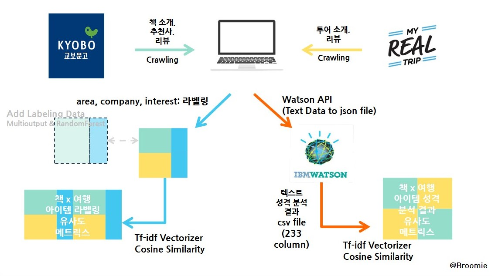
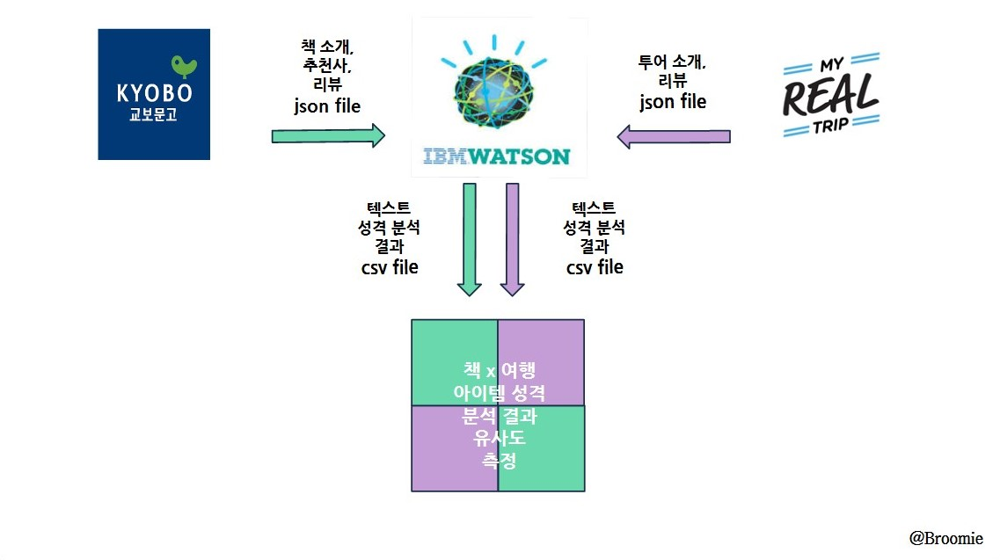

# 브루미Broomie :  Book & Travel Recommendation System

### Work Flow

#### Create info
- made by(alphabetical_order) : Bitna Bae, Dokyung Kim, Minhye Kim, Sunghyung Hong
- function :
    - find traveling type by Book item,
    - Recommend traveling tour
- tool : Python, MultioutputNB, IBM Personality Insight

## Project Summary
### What is Broomie?
- 베프처럼 독자에게 딱 맞는 여행을 추천해준다는 의미
    (The best tour recommendation system for readers like the best friends)
- 한국어 의성어 부르릉과 비슷한 발음
    (Sounds "Brooreung~" in Korean Onomatopoeia: the sound when a car or an airplane starts(Vroom!))
- besties + bros + homies + rommies의 합성어
    (Means 'A combination of the four following words: besties, bros, homies, and roomies')
- 브루미가 책 읽는 성향에 따라 독자에게 최고의 여행을 추천해주는 친한 친구가 되길 소망
    (Wish "Broomie" becomes the best friend for readers recommending the best tour based on their reading type)

### Motivation
- 직장인의 45%가 취미로 독서와 여행을 선택한 만큼, 수요가 많은 산업분야이다
    (Lots of Demand to Two industries: 45% of workers in Korea chose reading and traveling as their hobbies)
- 침체된 출판산업분야와 여행산업분야 서로를 연계시킨다면 차별화를 얻을 수 있다
    (Differenciated Services: unique service of liking book and travel industries)
- 한국어 자연어 처리를 통해 아이템 성격을 분석하는 기술을 연습한다
    (Text Analysis of Korean: defining item traits through Korean Natural Language Analysis)

### Data Introduction
- Book Data(label 1) :
    - site : 교보문고(Kyobo book homepage: http://www.kyobobook.co.kr/)
    - Book information(Scrapy), Book review(BeautifulSoup), Book keyword(Selenium)
    - columns :ISBN, title, author, book summary, book review, book keyword
    - total : 1507 items, 20 category(genres)
- Travel Data(label 2) :
    - site : 마이리얼트립(myrealtrip: https://www.myrealtrip.com/)
    - Travel information and Review(Beautiful Soup)
    - columns : tour_code, tour_city, tour_name, tour_info, tour_review
    - total : about 400 tour itmes

## Modeling Plan(Process)

### Crawling
- Book(사이트 소개)
	- site : 교보문고(Kyobo book homepage: http://www.kyobobook.co.kr/)
        - 가장 큰 온라인&오프라인 도서 유통 사이트(The biggest bookstore homepage in Korea)
        - 전통적으로 가장 많은 오프라인 서점 및 독자 보유(Traditionally it has lots of offline bookstore and readers)
        - 2019 최근 도서 구독 서비스 시작으로온라인에서도 서비스 제공((Recently starts book subscription service in 2019)

- Travel(사이트 소개)
	 - site : 마이리얼트립(myrealtrip: https://www.myrealtrip.com/)
        - 여행서비스 제공하는 한국 스타트업 사이트(Traveling start-up in Korea)
        - 여행계획을 스스로 짜는 젊은 층이 타겟층((Targeting young generation who plan their trip by themselves)
        - 호텔, 투어, 식당 등 여행자에게 필요한 모든 것 제공((Offers A-Z to travelers: booking hotels, tour, and restaurants)

### Labeling
- area(by their destination) :
    - 도시(City) : 야경, 관광, 쇼핑(seeing nightlight, walking local street, interesting fashion)
    - 자연(Nature) : 바다, 산, 별빛(seeing stars, the seaside, plant-holic, animal-holic)
- company(by their traveling purpose) :
    - 가족: parents, children,
    - 친구: friends
    - 혼자: alone, official, etc
    - 허니문: honeymoon, partner, lover

- interest :
    - 지식추구(Kn, Knowledge) : 역사, 궁, 사원, 건축물(history, science)
    - 문화예술(Ar, Culture&Art) : 박물관, 미술관(music, museum, art museum)
    - 도전(Ad, Adventure) : 캠핑, 하이킹, 스노클링(hiking, extreme sports, snorkeling)
    - 체험(Ex, Experience) : 농장투어, 만들기 체험, 크루즈체험, 돌고래(writing, making stuffs)
    - 보여주기(Sh, like to showing) : 셀피, 스냅사진(selfie, sanp picture, like to express themselves)
    - 음식(Fo, Food-lovers) : 식문화, 맛집, 와인투어(cooking, local food, Michelin et Cie, wine tour)
    - 오락(Et, Entertainment) : 카지노

### MultiOutput NB
- Define the best tour type using MultioutputNB(3 labels) from Book data
    - try1: Whole Text
    - try2: Keyword
    - try3: Noun Extraction

- Study tour_type using RandomForest with 417 book datas
- Fill 3 lables in rest datas(about 1000 datas) using the model

### Tfidf Matrix
- Vectorization
	- try1: Count vectorization
		- Offer Output based on simply word frequency: 
		- Recommendation of priority order: area(2) > company(4) > interest(7)
	- try2: Tf-idf vectorization
		- Offer Output based on distinct word that show characteristic of item: 
		- Recommendation of priority order: interenst(7) > company(4) > are(2)
- Study using Tfidf * Tfidf Matrix: link book item to tour based on type and detailed tour type
- Extract result by cosine similarity and opposite label: Input book title , Output best tour title and infos

## Extra Trial: Watson Personality Insight

- all the text information from datas
- make json file for each items
- vectorize by inputting to the Watson System
- using cosine similarity, find best tour itmes when inputting book title

## Issue Level(Problem Solving)
- lv.1 Extract result of opposite industires items using tfid x tfid matrix
- lv.2 Labeling
    - try1(labeling ambiguity): labeling by only one col.(9 entities) - multilables, multinomialNB
    - try2(detailed standard): divide 3 cols(area, company, interest) - multioutputNB

- lv.3 Raise Performance Score
    - add training datas
    - filter noise text
    - select importance features

- lv.3 Find 'how to use IBM Watson System' in Korean

## Things to do
- Raise Performance Score
- Make pre-trial Homepage
- Upload More item datas

